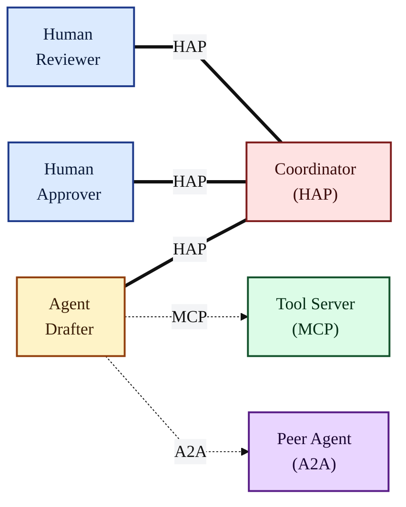
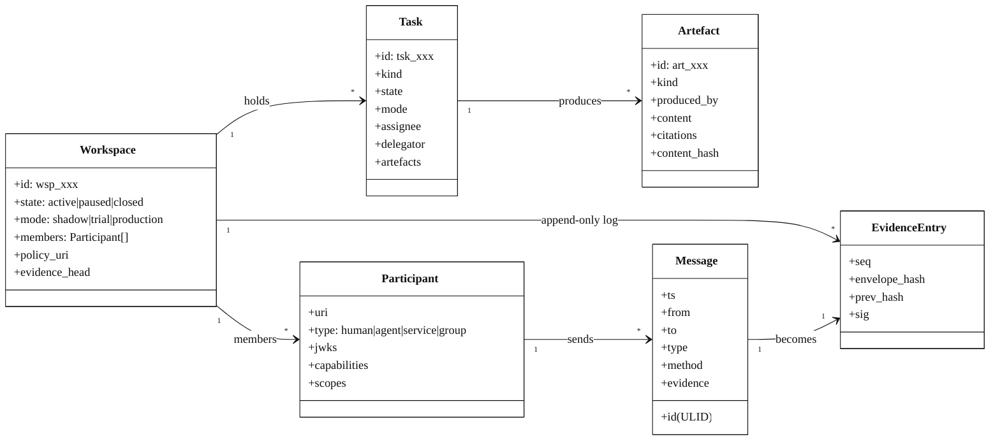
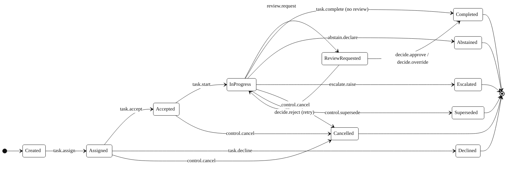
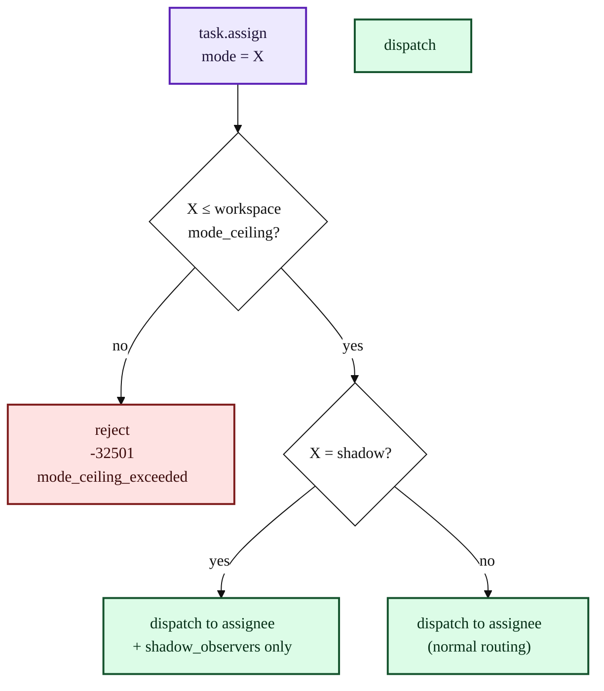
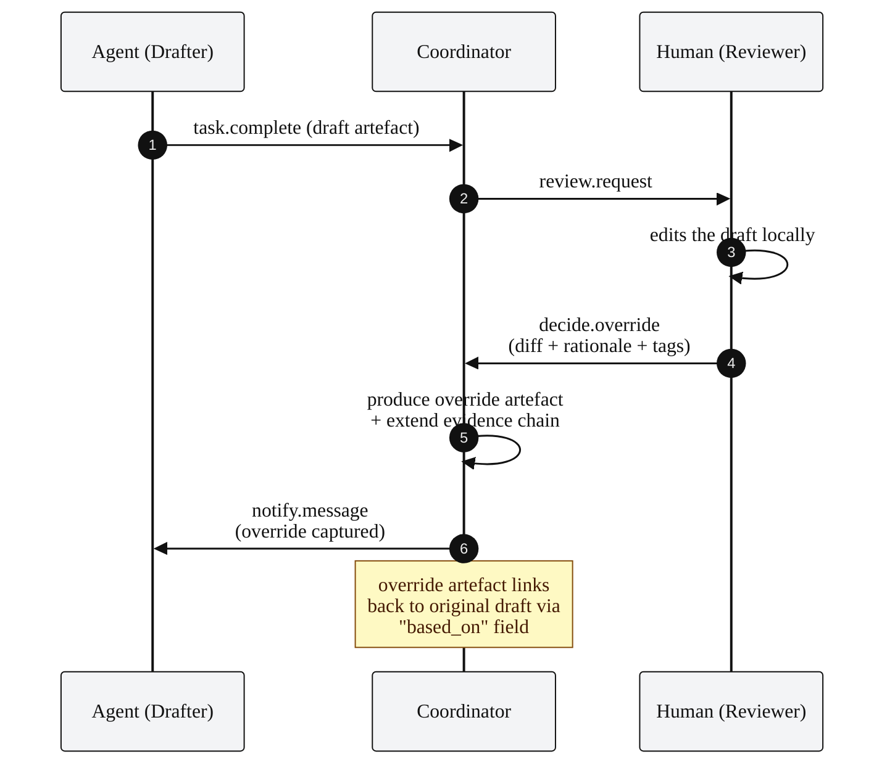
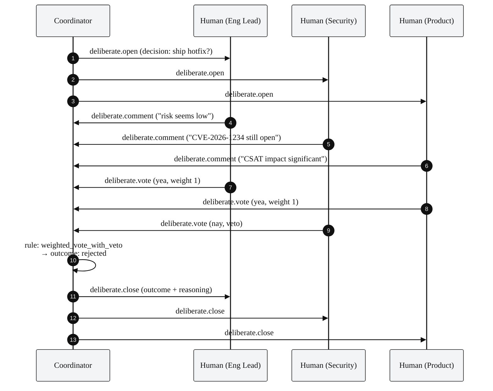
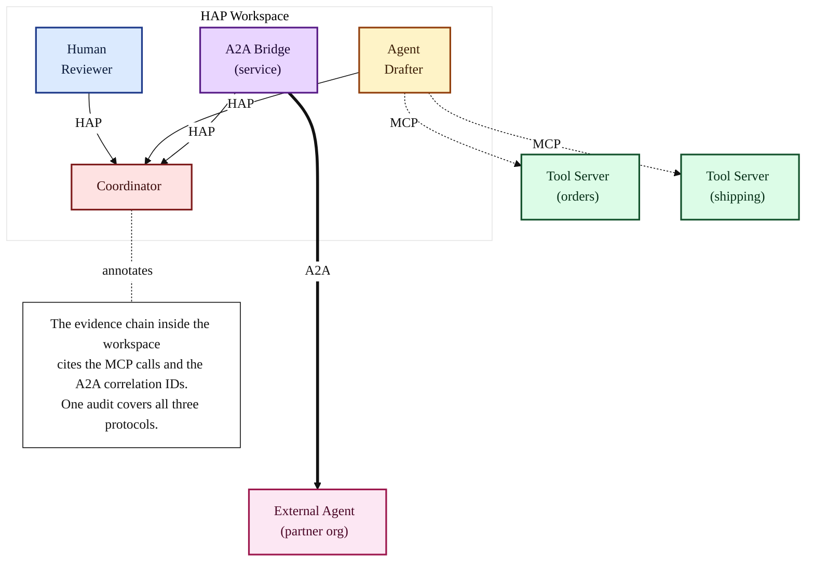
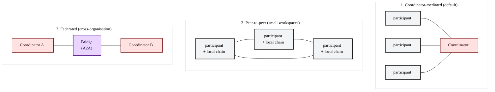

# HAP Architecture

This document is **informative**. It explains the design choices behind HAP,
how the primitives fit together, and what deployment topologies are practical.
For the normative wire format, see [SPECIFICATION.md](./SPECIFICATION.md).

---

## 1. The protocol stack

HAP sits alongside MCP and A2A. Each protocol owns a single concern.

**Reading the diagram.** Solid lines are HAP. Dotted lines are MCP and A2A.
HAP sits in the middle, holding the workspace; MCP and A2A radiate outward
to tools and external agents respectively.

---

## 2. Core primitives

HAP has a small set of primitives, related as follows.

**The contract.** Every Message becomes exactly one EvidenceEntry. Tasks
live inside Workspaces. Artefacts are produced by Tasks. Participants
send Messages. There is exactly one EvidenceEntry per accepted Message,
and the chain is per-Workspace.

---

## 3. Task lifecycle

A Task is the unit of work. Its state machine is small and explicit.

**Things to note.**

- `Declined` is terminal but **non-blocking** — the task can be reassigned
  by a new `task.assign`. The new assignment produces a new task ID.
- `Abstained` and `Escalated` are terminal **for this assignee** but
  trigger a new assignment to the escalation target.
- `Superseded` is the protocol's "redo" — the superseded task remains in
  the evidence chain, linked to its successor.

---

## 4. The evidence chain

HAP's audit guarantee is a per-workspace hash-linked log.

```mermaid
%%{init: {
  "theme": "base",
  "themeVariables": {
    "fontSize": "16px",
    "fontFamily": "Helvetica, Arial, sans-serif",
    "primaryColor": "#ffffff",
    "primaryTextColor": "#111111",
    "primaryBorderColor": "#111111",
    "lineColor": "#111111"
  },
  "flowchart": { "curve": "linear", "nodeSpacing": 40, "rankSpacing": 30 }
}}%%
flowchart LR
    classDef entry fill:#f8fafc,stroke:#0f172a,stroke-width:2px,color:#0f172a
    classDef chkpt fill:#fef9c3,stroke:#854d0e,stroke-width:2px,color:#451a03
    classDef anchor fill:#dcfce7,stroke:#14532d,stroke-width:2px,color:#052e16

    E0["entry 0<br/>genesis"]:::entry
    E1["entry 1<br/>task.assign"]:::entry
    E2["entry 2<br/>task.accept"]:::entry
    E3["entry 3<br/>task.complete"]:::entry
    E4["entry 4<br/>review.request"]:::entry
    E5["entry 5<br/>decide.approve"]:::entry
    CK["checkpoint<br/>(every 1000)"]:::chkpt
    AN["external<br/>anchor"]:::anchor

    E0 -->|prev_hash| E1
    E1 -->|prev_hash| E2
    E2 -->|prev_hash| E3
    E3 -->|prev_hash| E4
    E4 -->|prev_hash| E5
    E5 -. signs head .-> CK
    CK -. publishes to .-> AN
```

**Verification cost.** Replaying the entire chain is O(n) in entries and
fully parallelisable past any checkpoint. In practice, verifiers replay
only the segment of interest (typically a single task's worth of entries,
~10–50) and trust the latest checkpoint for the rest.

---

## 5. Mode-aware routing

Modes are an envelope-level concern. The Coordinator enforces them on
every dispatch.

**Promotion.** Moving a workspace from `trial` to `production` is a
privileged operation. It requires step-up authentication and matches
against an explicit policy entry. The transition is recorded as a
first-class evidence entry so promotion history is auditable.

---

## 6. Override capture

Overrides are where the protocol earns its keep. A human who modifies
an agent's draft produces a structured record — diff, rationale, tags —
that is immediately available for downstream learning.

**Why this matters.** Without HAP, an override is "the human changed
something and clicked Save." With HAP, it is a typed, signed, tagged,
diff-bearing artefact that downstream systems can learn from without
reverse-engineering the UI. Override patterns are now an analysable
asset of the workspace, not a tribal-knowledge loss.

---

## 7. Multi-human deliberation

When more than one human needs to weigh in, HAP carries the thread.

**Decision rules** are workspace policy. The protocol supports
`any_one_approves`, `all_approve`, `quorum:n`, `weighted_vote:threshold`,
and `weighted_vote_with_veto:threshold` out of the box.

---

## 8. Composition: HAP + MCP + A2A

A real deployment composes all three protocols. Here is the full picture.

**The audit story.** A regulator asks "show me everything that produced
this customer reply." The Coordinator returns:

- The HAP messages (signed, hash-linked).
- The cited MCP tool invocations (with hash-verified inputs and outputs).
- The cited A2A correlations (with cross-system attestation).

One query, one chain, three protocols.

---

## 9. Deployment topologies

HAP supports three deployment topologies, each with different trust and
operational trade-offs.

**1. Coordinator-mediated.** The default. One Coordinator per workspace,
responsible for routing, policy enforcement, and the evidence chain.
Simple, easy to operate, single point of failure (mitigated by
Coordinator HA).

**2. Peer-to-peer.** No central Coordinator; participants gossip
messages and each maintains a local copy of the chain. Suited to small,
high-trust workspaces. Requires CRDT-style convergence for the chain
head; defined as an extension for v0.2.

**3. Federated.** Each organisation runs its own Coordinator; cross-org
work moves over A2A via a bridge participant. The local chain remains
authoritative within each organisation; cross-org evidence joins via
the bridge's citations.

---

## 10. Performance characteristics

A reference Coordinator on a single 8-core machine handles, by
measurement on the reference implementation:

| Operation                          | Throughput          | p99 latency |
|------------------------------------|---------------------|-------------|
| Envelope verification (Ed25519+JCS)| ~12,000 msg/sec     | 1.8 ms      |
| Evidence append (no fsync)         | ~25,000 entries/sec | 0.4 ms      |
| Evidence append (fsync per entry)  | ~3,000 entries/sec  | 4.5 ms      |
| Chain replay (verify)              | ~40,000 entries/sec | n/a         |
| Full `audit.verify` over 100k entries | n/a              | 2.6 s       |

These numbers are indicative, not normative. Real throughput depends on
payload size, signature cache hit rate, and storage backend. The
chain-append operation is intentionally cheap; the signature
verification is the dominant cost.

---

## 11. What HAP is not

To avoid scope creep:

- **Not a workflow engine.** HAP carries the messages a workflow
  engine produces. The state of *which task comes next* lives in the
  application, not the protocol.
- **Not a knowledge base.** Artefacts are typed payloads; their
  semantics are application-defined.
- **Not a chat protocol.** `notify.message` exists but is intended
  for protocol-adjacent communication, not as a Slack replacement.
- **Not a permission system.** Roles and method-permission matrices
  live in the workspace policy; HAP carries the policy reference and
  enforces it.
- **Not an identity provider.** HAP relies on OIDC, SPIFFE, and
  workload identities; it does not issue tokens.

---

## 12. Open questions for the next draft

These items are tracked in [CHANGELOG.md](./CHANGELOG.md) and
[CONTRIBUTING.md](./CONTRIBUTING.md):

1. **Confidentiality extension.** Per-field encryption for evidence
   entries with sensitive content.
2. **Peer-to-peer chain convergence.** CRDT-style chain merging for
   the peer-to-peer topology.
3. **Cross-workspace evidence joins.** A canonical algorithm for
   joining chains across federated deployments.
4. **Capability descriptor.** A finer-grained alternative to the three
   conformance levels.
5. **Post-quantum signatures.** Hybrid Ed25519 + ML-DSA option.
6. **Interop test suite.** A formal conformance harness with negative
   tests.
