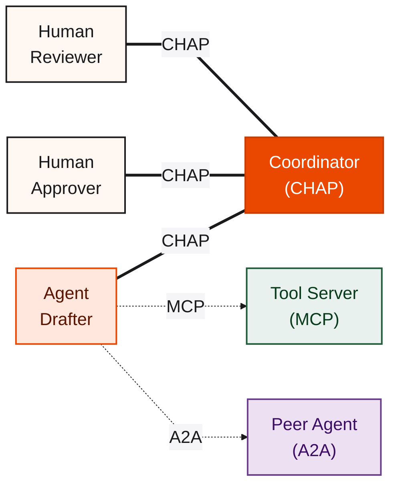
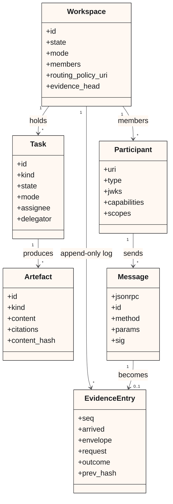
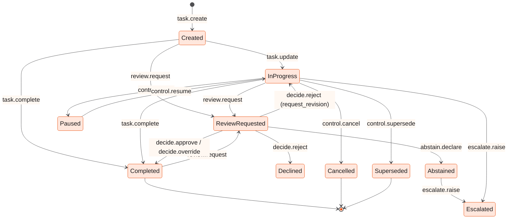
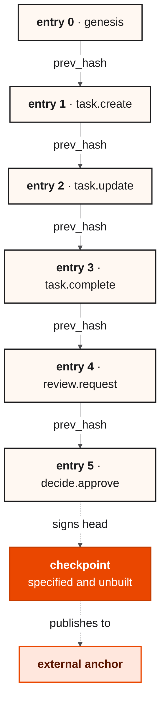
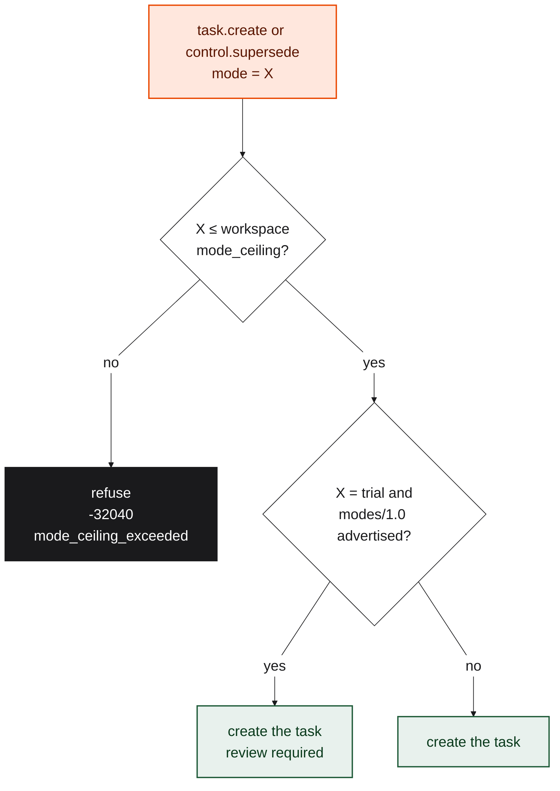
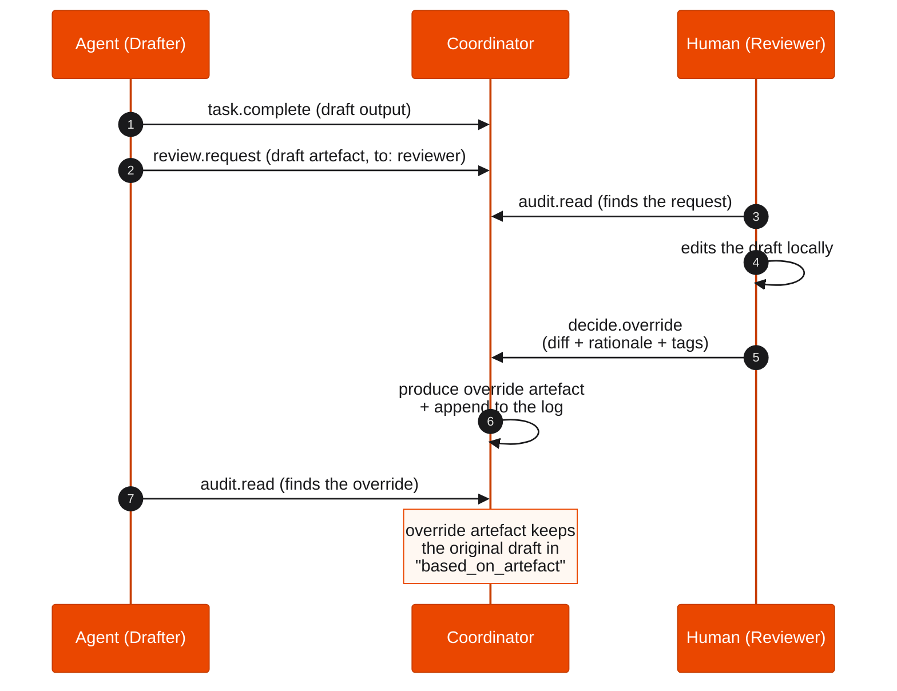
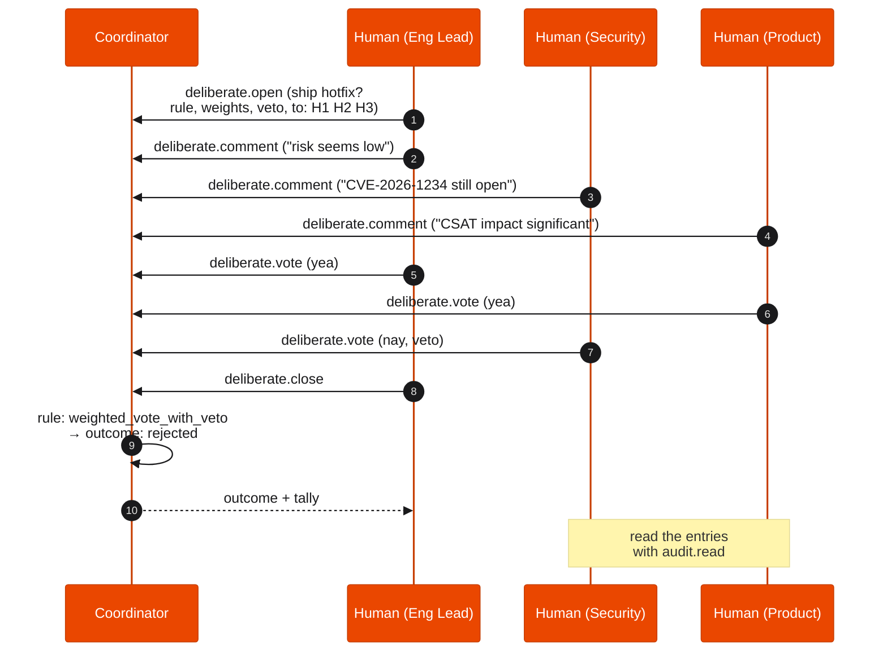
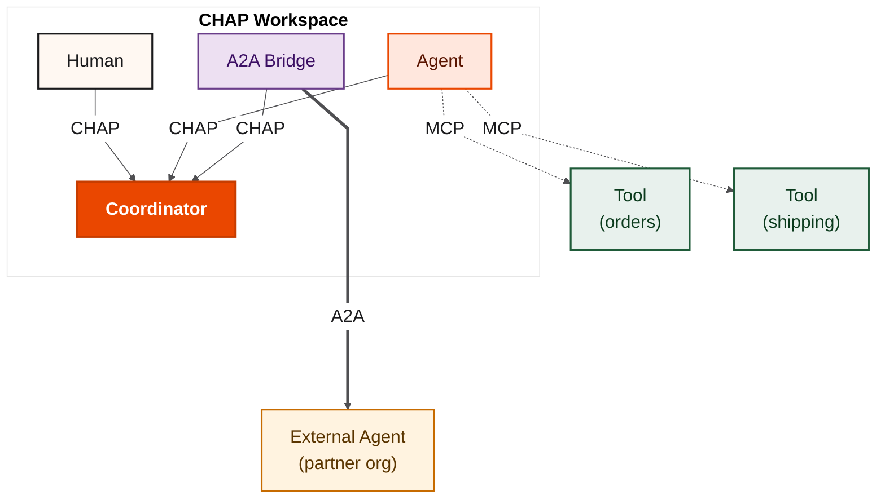
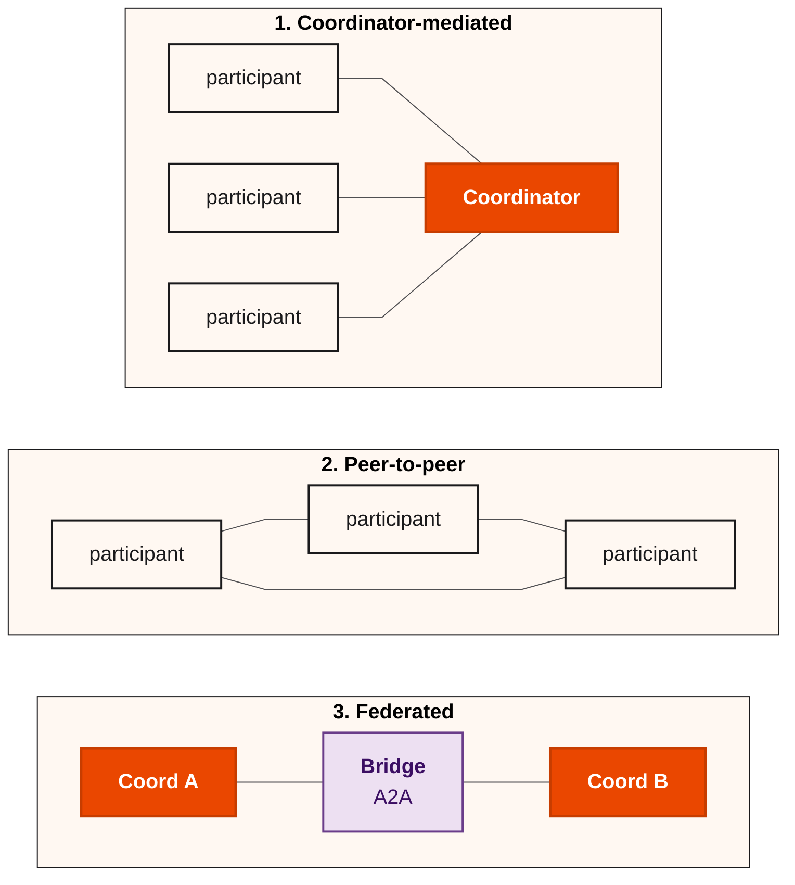

# CHAP Architecture

This document is **informative**. It explains the design choices behind CHAP,
how the primitives fit together, and what deployment topologies are practical.
For the wire format the coordinators speak, see [core/SPEC.md](./core/SPEC.md) §2.

---

## 1. The protocol stack

CHAP sits alongside MCP and A2A. Each protocol owns a single concern.

```mermaid
%%{init: {
  "theme": "base",
  "themeVariables": {
    "fontSize": "22px",
    "fontFamily": "Arial, Helvetica, sans-serif",
    "primaryColor": "#ffffff",
    "primaryTextColor": "#1a1a1c",
    "primaryBorderColor": "#1a1a1c",
    "lineColor": "#1a1a1c",
    "secondaryColor": "#f5f5f7",
    "tertiaryColor": "#FFF8F2"
  },
  "flowchart": { "curve": "linear", "nodeSpacing": 70, "rankSpacing": 90 }
}}%%
flowchart LR
    classDef human  fill:#FFF8F2,stroke:#1a1a1c,stroke-width:2px,color:#1a1a1c
    classDef agent  fill:#FFE7DD,stroke:#EA4700,stroke-width:2px,color:#5a1500
    classDef coord  fill:#EA4700,stroke:#C73D00,stroke-width:2px,color:#ffffff
    classDef tool   fill:#E8F1ED,stroke:#1f5b39,stroke-width:2px,color:#0a3a1c
    classDef peer   fill:#EDE0F2,stroke:#6a3d8a,stroke-width:2px,color:#3b0e63

    H1["Human<br/>Reviewer"]:::human
    H2["Human<br/>Approver"]:::human
    A1["Agent<br/>Drafter"]:::agent
    C["Coordinator<br/>(CHAP)"]:::coord
    T["Tool Server<br/>(MCP)"]:::tool
    P["Peer Agent<br/>(A2A)"]:::peer

    H1 ===|CHAP| C
    H2 ===|CHAP| C
    A1 ===|CHAP| C
    A1 -.->|MCP| T
    A1 -.->|A2A| P
```

**Reading the diagram.** Solid lines are CHAP. Dotted lines are MCP and A2A.
CHAP sits in the middle, holding the workspace; MCP and A2A radiate outward
to tools and external agents respectively.

---

## 2. Core primitives

CHAP has a small set of primitives, related as follows.

```mermaid
%%{init: {
  "theme": "base",
  "themeVariables": {
    "fontSize": "20px",
    "fontFamily": "Arial, Helvetica, sans-serif",
    "primaryColor": "#FFF8F2",
    "primaryTextColor": "#1a1a1c",
    "primaryBorderColor": "#1a1a1c",
    "lineColor": "#4f4f52"
  }
}}%%
classDiagram
    direction TB
    class Workspace {
      +id
      +state
      +mode
      +members
      +routing_policy_uri
      +evidence_head
    }
    class Participant {
      +uri
      +type
      +jwks
      +capabilities
      +scopes
    }
    class Task {
      +id
      +kind
      +state
      +mode
      +assignee
      +delegator
    }
    class Artefact {
      +id
      +kind
      +content
      +citations
      +content_hash
    }
    class EvidenceEntry {
      +seq
      +arrived
      +envelope
      +request
      +outcome
      +prev_hash
    }
    class Message {
      +jsonrpc
      +id
      +method
      +params
      +sig
    }

    Workspace "1" --> "*" Participant : members
    Workspace "1" --> "*" Task : holds
    Workspace "1" --> "*" EvidenceEntry : append-only log
    Task "1" --> "*" Artefact : produces
    Message "1" --> "0..1" EvidenceEntry : becomes
    Participant "1" --> "*" Message : sends
```

**The contract.** Every accepted state-changing Message becomes one
EvidenceEntry, and from 0.3.0 so does a member's refused governed attempt,
under `request` with its outcome
([SPECIFICATION.md §10.1](./SPECIFICATION.md#101-evidence-chain)). Reads
are never recorded. `audit-scitt/1.0` or a coordinator option switches the
hash chain on. A Message carries `workspace`, `from`, `to` and `ts` inside
`params`, and a top-level `sig` under `security-signed/1.0`. Tasks live
inside Workspaces, Artefacts are produced by Tasks, and Participants send
Messages.

**Authorisation layering.** Whether a Message is accepted at all is
decided in layers, innermost first:

1. **Membership (Core).** The actor (`from`) must be a joined member of
   the Workspace. Both coordinators check this for the Core task methods,
   the `review/1.0` methods, `workspace.set_profiles` and every control,
   deliberation, handoff and whisper method, and from 0.3.0 for
   `participant.leave` and the `routing/1.0` methods.
2. **Eligibility (profile).** A profile may narrow who, among members,
   may invoke a given method. `review/1.0` requires that the actor of a
   review decision be one of the reviewers the review was addressed to;
   `deliberation/1.0` requires a voter to be in the deliberation's voter
   list; `handoff/1.0` requires the recipient to be a member.
3. **Identity (profile).** `identity-oidc/1.0` and `identity-vc/1.0`
   bind a verified real-world identity to the actor. These compose with
   membership rather than replacing it: they raise the bar from "is a
   member" to "is a member with a freshly-verified identity," and apply
   only when the profile is in force.

Each layer is additive and audited. The membership layer is the one a
conforming Core implementation must enforce unconditionally; the others
are switched on by the workspace's profile set.

---

## 3. Task lifecycle

A Task is the unit of work. Its state machine is small and explicit.

```mermaid
%%{init: {
  "theme": "base",
  "themeVariables": {
    "fontSize": "20px",
    "fontFamily": "Arial, Helvetica, sans-serif",
    "primaryColor": "#FFE7DD",
    "primaryTextColor": "#1a1a1c",
    "primaryBorderColor": "#EA4700",
    "secondaryColor": "#FFF8F2",
    "secondaryTextColor": "#1a1a1c",
    "secondaryBorderColor": "#1a1a1c",
    "tertiaryColor": "#FFF8F2",
    "tertiaryTextColor": "#1a1a1c",
    "tertiaryBorderColor": "#1a1a1c",
    "lineColor": "#4f4f52"
  }
}}%%
stateDiagram-v2
    direction TB
    [*] --> Created : task.create
    Created --> InProgress : task.update
    Created --> ReviewRequested : review.request
    Created --> Completed : task.complete
    InProgress --> ReviewRequested : review.request
    InProgress --> Completed : task.complete
    Completed --> ReviewRequested : review.request
    ReviewRequested --> Completed : decide.approve / decide.override
    ReviewRequested --> Declined : decide.reject
    ReviewRequested --> InProgress : decide.reject (request_revision)
    ReviewRequested --> Abstained : abstain.declare
    Abstained --> Escalated : escalate.raise
    InProgress --> Escalated : escalate.raise
    InProgress --> Paused : control.pause
    Paused --> InProgress : control.resume
    InProgress --> Cancelled : control.cancel
    InProgress --> Superseded : control.supersede
    Completed --> [*]
    Cancelled --> [*]
    Superseded --> [*]
```

The exhaustive transition table is
[SPECIFICATION.md §8.1](./SPECIFICATION.md#81-lifecycle); the diagram above
shows the common path.

**Things to note.**

- `Completed` is terminal, but `review.request` accepts a completed task:
  completing a task and then requesting review of its output is one of the
  two ways to submit a draft. The other is `review_required` on
  `task.create`, where `task.complete` opens the review itself.
- `Declined` is **non-blocking**: the work can go back to a reviewer with
  another `review.request`, or move on with `escalate.raise`.
- `abstain.declare` moves the task to `Abstained` and assigns no one. A
  follow-up `escalate.raise` marks the task `Escalated` and creates a
  successor task for the escalation target.
- `Superseded` is the protocol's "redo", the superseded task remains in
  the evidence chain, linked to its successor.

---

## 4. The evidence chain

CHAP's audit guarantee is a per-workspace append-only log, hash-linked
when the chain is on.

```mermaid
%%{init: {
  "theme": "base",
  "themeVariables": {
    "fontSize": "20px",
    "fontFamily": "Arial, Helvetica, sans-serif",
    "primaryColor": "#ffffff",
    "primaryTextColor": "#1a1a1c",
    "primaryBorderColor": "#1a1a1c",
    "lineColor": "#4f4f52"
  },
  "flowchart": { "curve": "linear", "nodeSpacing": 50, "rankSpacing": 50, "padding": 16 }
}}%%
flowchart TB
    classDef entry  fill:#FFF8F2,stroke:#1a1a1c,stroke-width:2px,color:#1a1a1c
    classDef chkpt  fill:#EA4700,stroke:#C73D00,stroke-width:2.5px,color:#ffffff
    classDef anchor fill:#FFE7DD,stroke:#EA4700,stroke-width:2px,color:#5a1500

    E0["<b>entry 0</b> · genesis"]:::entry
    E1["<b>entry 1</b> · task.create"]:::entry
    E2["<b>entry 2</b> · task.update"]:::entry
    E3["<b>entry 3</b> · task.complete"]:::entry
    E4["<b>entry 4</b> · review.request"]:::entry
    E5["<b>entry 5</b> · decide.approve"]:::entry
    CK["<b>checkpoint</b><br/>specified and unbuilt"]:::chkpt
    AN["<b>external anchor</b>"]:::anchor

    E0 -->|prev_hash| E1
    E1 -->|prev_hash| E2
    E2 -->|prev_hash| E3
    E3 -->|prev_hash| E4
    E4 -->|prev_hash| E5
    E5 -. signs head .-> CK
    CK -. publishes to .-> AN
```

**Verification cost.** `audit.verify_chain` replays the whole log, O(n) in
entries, and refuses ranges; checkpoints are specified and unbuilt.

---

## 5. Mode ceilings

The Coordinator checks a new task's mode against the ceiling at
`task.create` and `control.supersede`, and under `modes/1.0` a trial task
requires review. Withholding shadow output is the deployment's job.

```mermaid
%%{init: {
  "theme": "base",
  "themeVariables": {
    "fontSize": "22px",
    "fontFamily": "Arial, Helvetica, sans-serif",
    "primaryColor": "#ffffff",
    "primaryTextColor": "#1a1a1c",
    "primaryBorderColor": "#1a1a1c",
    "lineColor": "#1a1a1c"
  },
  "flowchart": { "curve": "linear", "nodeSpacing": 70, "rankSpacing": 90, "padding": 22 }
}}%%
flowchart TB
    classDef mode  fill:#FFE7DD,stroke:#EA4700,stroke-width:2px,color:#5a1500
    classDef ok    fill:#E8F1ED,stroke:#1f5b39,stroke-width:2px,color:#0a3a1c
    classDef block fill:#1a1a1c,stroke:#1a1a1c,stroke-width:2px,color:#ffffff

    IN["task.create or control.supersede<br/>mode = X"]:::mode
    CHK{"X ≤ workspace<br/>mode_ceiling?"}
    NO["refuse<br/>-32040<br/>mode_ceiling_exceeded"]:::block
    TRIAL{"X = trial and<br/>modes/1.0 advertised?"}
    REVIEW["create the task<br/>review required"]:::ok
    PLAIN["create the task"]:::ok

    IN --> CHK
    CHK -- no  --> NO
    CHK -- yes --> TRIAL
    TRIAL -- yes --> REVIEW
    TRIAL -- no  --> PLAIN
```

**Promotion.** A workspace's mode is fixed at creation until
`workspace.set_mode` is built. `control.set_mode_ceiling`, privileged and
recorded, sets the highest mode a new task may carry. Step-up guards it
where the coordinator enforces step-up.

---

## 6. Override capture

Overrides are where the protocol earns its keep. A human who modifies
an agent's draft produces a structured record, diff, rationale, tags.
that is immediately available for downstream learning.

```mermaid
%%{init: {
  "theme": "base",
  "themeVariables": {
    "fontSize": "22px",
    "fontFamily": "Arial, Helvetica, sans-serif",
    "primaryColor": "#ffffff",
    "primaryTextColor": "#1a1a1c",
    "primaryBorderColor": "#1a1a1c",
    "lineColor": "#1a1a1c",
    "actorBkg": "#EA4700",
    "actorTextColor": "#ffffff",
    "actorBorder": "#C73D00",
    "labelTextColor": "#1a1a1c",
    "noteBkgColor": "#FFF8F2",
    "noteTextColor": "#1a1a1c",
    "noteBorderColor": "#EA4700"
  }
}}%%
sequenceDiagram
    autonumber
    participant A as Agent (Drafter)
    participant C as Coordinator
    participant H as Human (Reviewer)

    A->>C: task.complete (draft output)
    A->>C: review.request (draft artefact, to: reviewer)
    H->>C: audit.read (finds the request)
    H->>H: edits the draft locally
    H->>C: decide.override<br/>(diff + rationale + tags)
    C->>C: produce override artefact<br/>+ append to the log
    A->>C: audit.read (finds the override)
    Note over C: override artefact keeps<br/>the original draft in<br/>"based_on_artefact"
```

**Why this matters.** Without CHAP, an override is "the human changed
something and clicked Save." With CHAP, it is a typed, tagged,
diff-bearing record, signed where `security-signed/1.0` is on, that
downstream systems can learn from without reverse-engineering the UI.
Override patterns become an asset of the workspace that anyone can
analyse, where before they were lost as tribal knowledge.

---

## 7. Multi-human deliberation

When more than one human needs to weigh in, CHAP carries the thread.

```mermaid
%%{init: {
  "theme": "base",
  "themeVariables": {
    "fontSize": "22px",
    "fontFamily": "Arial, Helvetica, sans-serif",
    "primaryColor": "#ffffff",
    "primaryTextColor": "#1a1a1c",
    "primaryBorderColor": "#1a1a1c",
    "lineColor": "#1a1a1c",
    "actorBkg": "#EA4700",
    "actorTextColor": "#ffffff",
    "actorBorder": "#C73D00"
  }
}}%%
sequenceDiagram
    autonumber
    participant C as Coordinator
    participant H1 as Human (Eng Lead)
    participant H2 as Human (Security)
    participant H3 as Human (Product)

    H1->>C: deliberate.open (ship hotfix?<br/>rule, weights, veto, to: H1 H2 H3)
    H1->>C: deliberate.comment ("risk seems low")
    H2->>C: deliberate.comment ("CVE-2026-1234 still open")
    H3->>C: deliberate.comment ("CSAT impact significant")
    H1->>C: deliberate.vote (yea)
    H3->>C: deliberate.vote (yea)
    H2->>C: deliberate.vote (nay, veto)
    H1->>C: deliberate.close
    C->>C: rule: weighted_vote_with_veto<br/>→ outcome: rejected
    C-->>H1: outcome + tally
    Note over H2,H3: read the entries<br/>with audit.read
```

**Decision rules** are set on each `deliberate.open`. `deliberation/1.0`
accepts `any_one_approves`, `all_approve`, `quorum:n`,
`weighted_vote:threshold` and `weighted_vote_with_veto:threshold`;
`review/1.0` accepts the first three. The coordinator pushes nothing to
participants: each reads the thread with `audit.read`.

---

## 8. Composition: CHAP + MCP + A2A

A real deployment composes all three protocols. Here is the full picture.

```mermaid
%%{init: {
  "theme": "base",
  "themeVariables": {
    "fontSize": "20px",
    "fontFamily": "Arial, Helvetica, sans-serif",
    "primaryColor": "#ffffff",
    "primaryTextColor": "#1a1a1c",
    "primaryBorderColor": "#1a1a1c",
    "lineColor": "#4f4f52"
  },
  "flowchart": { "curve": "linear", "nodeSpacing": 50, "rankSpacing": 60, "padding": 16 }
}}%%
flowchart TB
    classDef human fill:#FFF8F2,stroke:#1a1a1c,stroke-width:2px,color:#1a1a1c
    classDef agent fill:#FFE7DD,stroke:#EA4700,stroke-width:2px,color:#5a1500
    classDef coord fill:#EA4700,stroke:#C73D00,stroke-width:2.5px,color:#ffffff
    classDef tool  fill:#E8F1ED,stroke:#1f5b39,stroke-width:2px,color:#0a3a1c
    classDef bridge fill:#EDE0F2,stroke:#6a3d8a,stroke-width:2px,color:#3b0e63
    classDef ext   fill:#FFF3E0,stroke:#C76B00,stroke-width:2px,color:#5a3500

    subgraph WS["<b>CHAP Workspace</b>"]
      H["Human"]:::human
      A["Agent"]:::agent
      C["<b>Coordinator</b>"]:::coord
      B["A2A Bridge"]:::bridge
    end

    T1["Tool<br/>(orders)"]:::tool
    T2["Tool<br/>(shipping)"]:::tool
    EXT["External Agent<br/>(partner org)"]:::ext

    H -->|CHAP| C
    A -->|CHAP| C
    B -->|CHAP| C
    A -.->|MCP| T1
    A -.->|MCP| T2
    B ====>|A2A| EXT
```

**The audit story.** A regulator asks "show me everything that produced
this customer reply." The Coordinator returns:

- The CHAP messages (signed under `security-signed/1.0`, hash-linked
  when the chain is on).
- The cited MCP tool invocations (with hash-verified inputs and outputs).
- The cited A2A correlations (with cross-system attestation).

One query, one chain, three protocols.

### 8.1 Inward composition: MCP-clients and A2A-orchestrators driving CHAP

The diagram above shows CHAP citing MCP tool calls and bridging to
A2A peers, which is the **outward** composition direction. The
**inward** direction is symmetric: the Coordinator can present
itself as an MCP server or A2A agent, with every CHAP method exposed
as a discrete tool or skill. Then an MCP client (Claude Desktop,
Cursor, Claude Code) or an A2A orchestrator (Azure AI Foundry,
Amazon Bedrock AgentCore, Google ADK) can drive the workspace
without writing any CHAP-specific code.

Both directions stack. The CHAP-as-MCP-server adapter is at
`packages/coordinator-mcp/`, the CHAP-as-A2A-agent adapter at
`packages/coordinator-a2a/`. Runnable reference servers ship for
each in `reference/mcp-server-{ts,py}/` and `reference/a2a-server-{ts,py}/`.
The TypeScript adapter speaks A2A 0.3 and the Python adapter A2A 1.0.
Milestone 0.5 moves the TypeScript adapter to A2A 1.0.

---

## 9. Deployment topologies

CHAP supports three deployment topologies, each with different trust and
operational trade-offs.

```mermaid
%%{init: {
  "theme": "base",
  "themeVariables": {
    "fontSize": "20px",
    "fontFamily": "Arial, Helvetica, sans-serif",
    "primaryColor": "#ffffff",
    "primaryTextColor": "#1a1a1c",
    "primaryBorderColor": "#1a1a1c",
    "lineColor": "#4f4f52",
    "clusterBkg": "#FFF8F2",
    "clusterBorder": "#1a1a1c"
  },
  "flowchart": { "curve": "linear", "nodeSpacing": 50, "rankSpacing": 60, "padding": 18 }
}}%%
flowchart TB
    classDef coord fill:#EA4700,stroke:#C73D00,stroke-width:2.5px,color:#ffffff
    classDef part  fill:#FFF8F2,stroke:#1a1a1c,stroke-width:2px,color:#1a1a1c
    classDef peer  fill:#EDE0F2,stroke:#6a3d8a,stroke-width:2px,color:#3b0e63

    subgraph T1["<b>1. Coordinator-mediated</b>"]
      direction LR
      P1A["participant"]:::part
      P1B["participant"]:::part
      P1C["participant"]:::part
      C1["<b>Coordinator</b>"]:::coord
      P1A --- C1
      P1B --- C1
      P1C --- C1
    end

    subgraph T2["<b>2. Peer-to-peer</b>"]
      direction LR
      P2A["participant"]:::part
      P2B["participant"]:::part
      P2C["participant"]:::part
      P2A --- P2B
      P2B --- P2C
      P2A --- P2C
    end

    subgraph T3["<b>3. Federated</b>"]
      direction LR
      C3A["<b>Coord A</b>"]:::coord
      BR["<b>Bridge</b><br/>A2A"]:::peer
      C3B["<b>Coord B</b>"]:::coord
      C3A --- BR
      BR --- C3B
    end

    T1 ~~~ T2
    T2 ~~~ T3
```

**1. Coordinator-mediated.** The default. One Coordinator per workspace,
responsible for checking each call and keeping the log. Simple, easy to
operate, and a single writer: a standby started from the store can take
over, but two active instances on one workspace lose entries
([SPECIFICATION.md §10.3](./SPECIFICATION.md#103-single-writer-requirement)).

**2. Peer-to-peer.** Unsupported: no implementation exists, convergence
is open, and a chain needs one writer
([SPECIFICATION.md §10.3](./SPECIFICATION.md#103-single-writer-requirement)).

**3. Federated.** Each organisation runs its own Coordinator; cross-org
work moves over A2A via a bridge participant. The local chain remains
authoritative within each organisation; cross-org evidence joins via
the bridge's citations.

---

## 10. Performance characteristics

No benchmark is published yet; milestone 0.4 adds one to every release.

---

## 10a. Routing signals vs routing decisions

A common pressure on protocols like CHAP is to encode business
logic into the wire format: cost thresholds, criticality taxonomies,
auto-escalation rules. We have resisted this, but we also can't
ignore that real deployments route work based on these factors.
otherwise every refund draft and every ad-copy draft gets the same
review treatment, which is operationally absurd.

The discipline CHAP follows: **carry the signals, don't interpret them.**

Core defines two opaque `routing_hints` objects:

- **`Task.routing_hints`**: `criticality`, `deadline`,
  `max_cost_usd`, `risk_tier`. The *budget*: what the work is and
  what it's allowed to cost.
- **`Artefact.routing_hints`**: `confidence`, `model_id`,
  `cost_consumed_usd`, `latency_ms`. The *measurement*: what was
  actually produced, by what, at what cost.

CHAP says nothing about what the values mean. `criticality: high`
means whatever the operator's policy says it means. `confidence: "0.7"`
is calibrated only against the model that produced it. Decimals travel
as strings, because both coordinators refuse a number that is not an
integer. A `risk_tier`
of `pci-cardholder` is opaque to the protocol.

CHAP records the hints with the call, signed under `security-signed/1.0`
and hashed when the chain is on. If a routing decision was made because
confidence was 0.62 and criticality was high, the audit log keeps those
exact values, so the decision can be audited later.

The `routing/1.0` profile then defines the decisions: `task.route`
picks an assignee, `review.depth` decides how thoroughly to review,
`escalate.auto` evaluates rules. Each decision produces a
`route_decision` artefact citing the hints it consulted. The
Coordinator holds the artefact in the workspace and returns it to the
caller; the audit log records the request that produced it.

This split lets a Core-only deployment carry routing signals across
hops without understanding them, the audit chain remains intact
even when an intermediary node doesn't run the routing profile. And
it lets the routing rules evolve independently of the protocol: a
new policy version is just a new `policy_id` referenced from a
decision artefact, not a CHAP version bump.

The general principle generalises: **CHAP carries evidence, not
behaviour**. Behaviour belongs to operators; the protocol's job is
to make sure behaviour is observable.

---

## 11. What CHAP is not

To avoid scope creep:

- **Not a workflow engine.** CHAP carries the messages a workflow
  engine produces. The state of *which task comes next* lives in the
  application, not the protocol.
- **Not a knowledge base.** Artefacts are typed payloads; their
  semantics are application-defined.
- **Not a chat protocol.** `notify.message` exists but is intended
  for protocol-adjacent communication, not as a Slack replacement.
- **Not a permission system.** Roles and method-permission matrices
  belong to the deployment. Neither coordinator controls admission yet:
  `participant.join` admits any caller in the role it asks for. Until
  milestone 0.6, authenticate joins and enforce role policy in front of
  the coordinator.
- **Not an identity provider.** CHAP relies on OIDC, SPIFFE, and
  workload identities; it does not issue tokens.

---

## 12. Open questions for the next draft

[ROADMAP.md](./ROADMAP.md) is the reference for what is planned and when.
Open items include:

1. **Confidentiality extension.** Per-field encryption for evidence
   entries with sensitive content.
2. **Peer-to-peer chain convergence.** CRDT-style chain merging for
   the peer-to-peer topology.
3. **Cross-workspace evidence joins.** A canonical algorithm for
   joining chains across federated deployments.
4. **Capability descriptor.** A finer-grained statement of what an
   implementation supports. Milestone 0.4 replaces the conformance levels
   with conformance by profile.
5. **Post-quantum signatures.** Hybrid Ed25519 + ML-DSA option.
6. **Interop test suite.** A formal conformance harness with negative
   tests.
