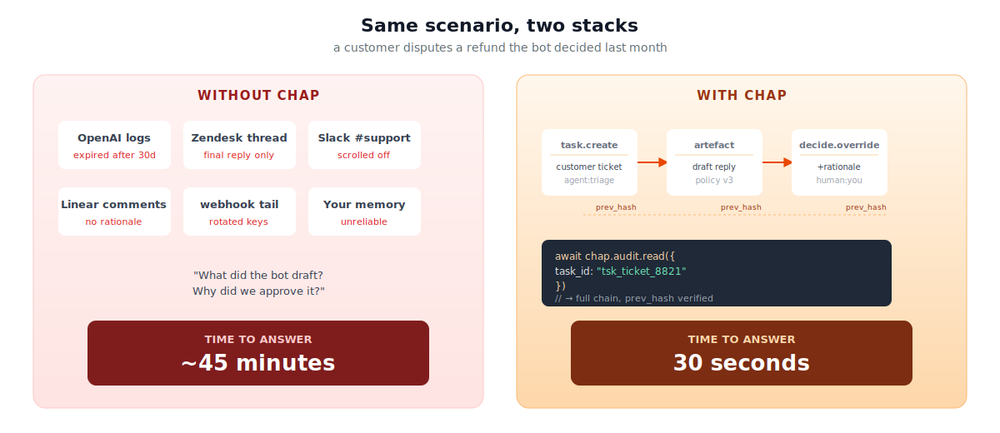
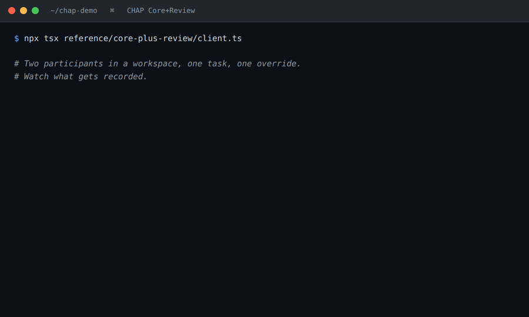
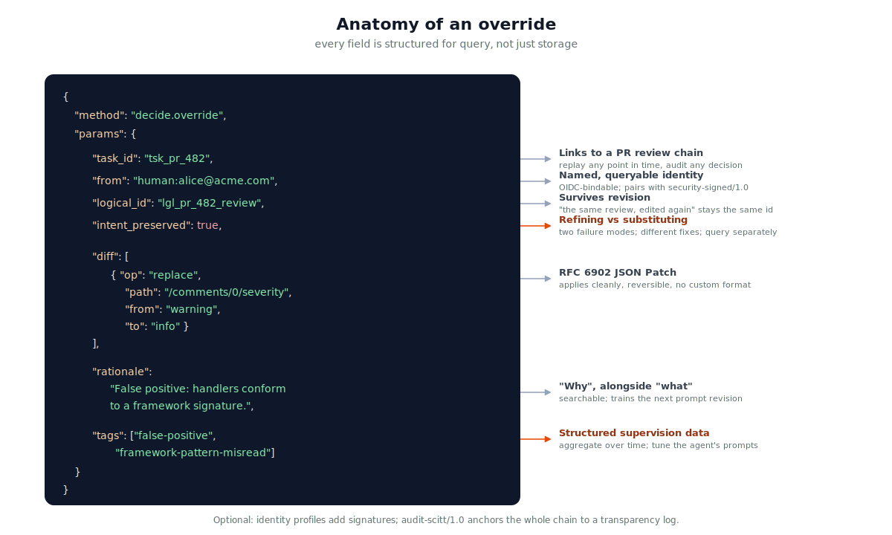

<div align="center">

# Collaborative Human-Agent Protocol (CHAP)

**The protocol for humans and agents doing real work together.**

When a bot drafts something and a human edits it, where does that edit live?
In CHAP, it lives in an envelope you can query, replay, and verify six months later.

[Install](#install) · [The 90-second tour](#the-90-second-tour) · [Twelve scenarios](./IN_PRACTICE.md) · [About this repo](./ABOUT.md) · [Paper](https://arxiv.org/abs/2606.09751)

</div>

---

<p align="center">
  
</p>

---

## Why CHAP exists

You have agents doing real work. Drafting code reviews, triaging tickets, suggesting settlements, reviewing contracts. A human approves, edits, or rejects each one. Right now, that decision lives in your application code, your chat threads, your ticket comments, and your head. When something goes wrong six weeks later, reconstructing what happened costs you forty-five minutes and is half guesswork.

CHAP gives you one place to put those decisions and one shape to put them in. The agent's draft is an artefact. The human's edit is a structured override with a diff, a rationale, and tags you control. The whole thing chains together by content hash. You query the chain instead of grepping logs across four UIs.

That's the whole pitch.

## The 90-second tour

A solo developer using Cursor to review pull requests. The bot flags a "warning" the developer disagrees with. Here is the whole exchange, end to end.

<p align="center">
  
</p>

And here is the code, every line of it.

**1. Spin up a workspace.** Twelve lines, one binary, SQLite for storage:

```ts
import { Coordinator } from "@chap/coordinator";

const coord = new Coordinator({ storage: "sqlite:./chap.db" });

await coord.dispatch({
  jsonrpc: "2.0", id: "1",
  method: "workspace.create",
  params: {
    workspace_id: "wsp_pr_reviews",
    profiles: ["core/1.0", "review/1.0"]
  }
});

await coord.dispatch({
  jsonrpc: "2.0", id: "2",
  method: "participant.join",
  params: { workspace_id: "wsp_pr_reviews", uri: "human:me@local" }
});
```

**2. The bot drafts, you override.** Wire your existing Cursor integration to emit envelopes:

```ts
// The bot's review is an artefact attached to a task.
await coord.dispatch({
  jsonrpc: "2.0", id: "3",
  method: "task.create",
  params: { workspace_id: "wsp_pr_reviews", artefact: cursorReview }
});

// You disagree with one comment. Override it.
await coord.dispatch({
  jsonrpc: "2.0", id: "4",
  method: "decide.override",
  params: {
    task_id: "tsk_pr_482",
    from: "human:me@local",
    intent_preserved: true,
    diff: [{ op: "replace", path: "/comments/0/severity",
             from: "warning", to: "info" }],
    rationale: "False positive. Framework convention, not a bug.",
    tags: ["false-positive", "framework-pattern-misread"]
  }
});
```

**3. Two months in, analyse what you have been doing.** This is where the protocol pays you back:

```bash
$ npx @chap/analyze-overrides wsp_pr_reviews

Override Learning Report
========================
Total overrides: 47

By tag:
  false-positive             ████████████████  31  (66%)
  framework-pattern-misread  ███████████       22  (47%)
  cosmetic-pref              ████              8   (17%)

Top file paths:
  src/handlers/                                    18 overrides
  src/components/                                  9  overrides
```

Your next prompt revision for Cursor is no longer a guess. It cites the pattern by name.

---

## The override envelope, in detail

The override envelope is the single most important shape in CHAP. Every field has a job:

<p align="center">
  
</p>

The two fields most people miss on first read are `intent_preserved` and `tags`.

`intent_preserved` distinguishes a *refining* override (the human agreed with the agent's decision but rewrote how it was expressed) from a *substituting* override (the human reached a different decision). These are two different failure modes and they want different fixes. A high refining rate around one policy clause means the agent's retrieval is off; a high substituting rate on the same clause means the policy itself is ambiguous, or the agent's task context is wrong.

`tags` is the controlled vocabulary your team agrees on. Keep it small. Whatever you put there is the dimension you will aggregate on three months from now, when you are answering questions like *which prompts need work?* or *which paths is the bot getting consistently wrong?*

## Install

```bash
npm install @chap/coordinator
```

That gets you Core plus the `review/1.0` profile, in-memory and SQLite backends, a CLI, and a two-participant playground. The TypeScript reference is in [`reference/`](./reference/); the protocol-as-a-library is [`packages/coordinator/`](./packages/coordinator/).

Five-minute hands-on walkthrough: [`examples/00-five-minute-start.md`](./examples/00-five-minute-start.md).

## What ships today

CHAP 0.2 is a public draft. Concretely, this repo contains:

- **The specification.** Core (seven methods, one envelope, one wire format) plus ten optional profiles. Combined into a single document at [`SPECIFICATION.md`](./SPECIFICATION.md), or read individually from [`core/SPEC.md`](./core/SPEC.md) and [`profiles/`](./profiles/).
- **One reference implementation in TypeScript.** Core, the `review/1.0` profile, a coordinator, a CLI, an override analyser, and a runnable playground with two human browser sessions and a local LLM. A second interoperable implementation is the most consequential thing remaining before 1.0.
- **A conformance harness.** 21 test vectors, signing/canonicalisation/chain checks, in-toto attestation output. Two conformance levels are claimable today (Minimal, Recommended); Full waits on the second implementation.
- **Twelve worked scenarios.** [`IN_PRACTICE.md`](./IN_PRACTICE.md) walks through real cases from a solo developer with Cursor up to GMP-regulated fill-finish manufacturing.

Breaking changes follow Semantic Versioning. Profile surfaces will move faster than Core. Production deployments needing strict stability should wait for 1.0. The longer status statement and the contribution path are in [`ABOUT.md`](./ABOUT.md).

## What you get when you adopt this

- **An audit chain that survives key rotation, log expiry, and people leaving.** Every envelope links to the previous by content hash. One `audit.read` call returns the whole thing.
- **Structured supervision data as a side effect of normal work.** No separate annotation pipeline. The overrides you are already making become a dataset you would otherwise have to commission.
- **Signed, non-repudiable approvals when you need them.** Opt into `security-signed/1.0` for OIDC-bound signatures with a `signature_meaning` you define. Opt into `audit-scitt/1.0` for an external transparency-log anchor, verifiable without trusting your servers.
- **Composability with what you have already built.** CHAP does not replace MCP or A2A. It sits next to them: your agent uses MCP for tools, A2A for other agents, and CHAP to record the shared work with humans.

## Read this next

- **[`IN_PRACTICE.md`](./IN_PRACTICE.md)**. Twelve real-world scenarios from solo dev to GMP-regulated manufacturing. The most useful next read.
- **[`ABOUT.md`](./ABOUT.md)**. What is in this repo, how CHAP relates to MCP and A2A, the standards it reuses, and how to contribute.
- **[`core/SPEC.md`](./core/SPEC.md)**. The seven Core methods. The whole protocol surface fits on one screen.
- **[Technical report on arXiv](https://arxiv.org/abs/2606.09751)**. The full paper. Architecture, design rationale, profile semantics, threat model, and a worked appendix with the twelve scenarios as JSON traces. For readers who want the protocol grounded in its design choices.

## Cite

If you reference CHAP in academic or technical work, please cite the technical report:

```bibtex
@techreport{chap2026,
  author      = {Shahid, Arsalan and Suttie, Gordon and Black, Philip},
  title       = {Collaborative Human-Agent Protocol (CHAP): An open protocol for auditable, structured multi-human and multi-agent collaboration},
  institution = {Brightbeam AI},
  year        = {2026},
  type        = {Technical Report},
  number      = {arXiv:2606.09751},
  url         = {https://arxiv.org/abs/2606.09751}
}
```

---

CC-BY 4.0 (specification) · Apache 2.0 (code) · Royalty-free, any language, any deployment.
