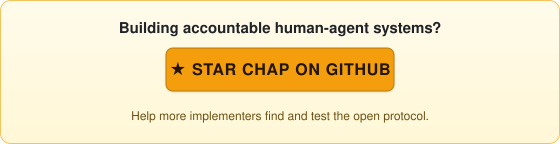
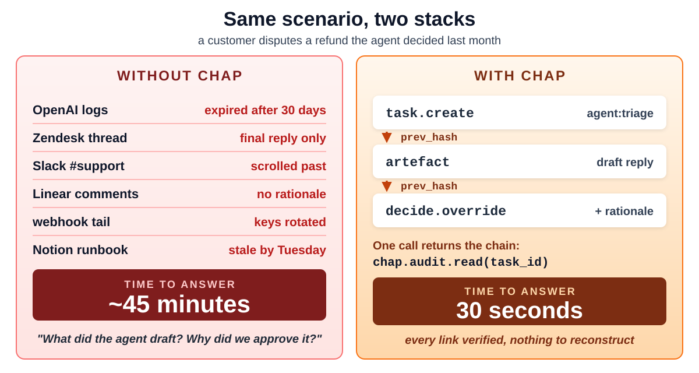
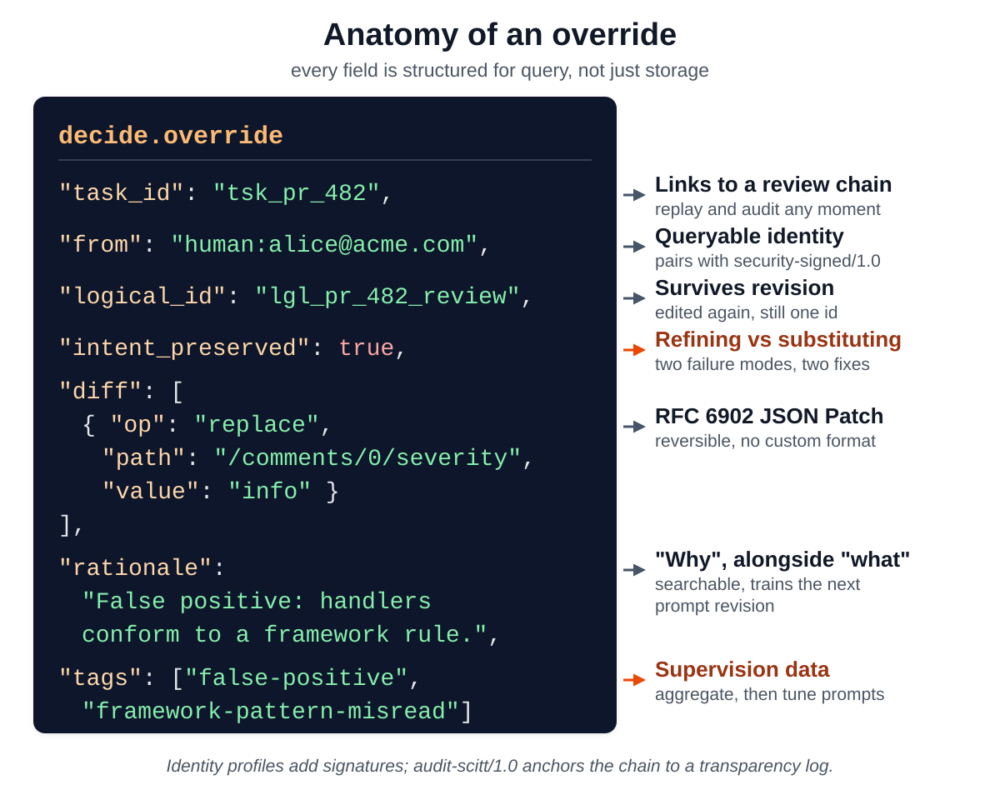

<div align="center">

# Collaborative Human-Agent Protocol (CHAP)

<p align="center">
  <a href="https://github.com/BrightbeamAI/chap/releases/latest"></a>
  <a href="https://pypi.org/project/chap-coordinator/"></a>
  <a href="https://www.npmjs.com/package/@brightbeamai/chap-coordinator"></a>
  <a href="https://github.com/BrightbeamAI/chap/tree/main/conformance"></a>
  <a href="https://github.com/BrightbeamAI/chap/blob/main/LICENSE"></a>
  <a href="https://github.com/BrightbeamAI/chap/blob/main/LICENSE"></a>
</p>

<p align="center">
  <strong>The open protocol for humans and agents doing accountable work together.</strong>
</p>

<p align="center">
  CHAP gives approvals, overrides, handoffs and escalations a shared, auditable shape across MCP and A2A.
</p>

<p align="center">
  <a href="#install">Install</a> ·
  <a href="./examples/drive-chap-from-claude-desktop.md">MCP quickstart</a> ·
  <a href="#the-90-second-tour">90-second tour</a> ·
  <a href="./IN_PRACTICE.md">Scenarios</a> ·
  <a href="./IMPLEMENTATIONS.md">Implementations</a> ·
  <a href="https://github.com/BrightbeamAI/chap/wiki">Wiki</a> ·
  <a href="https://github.com/BrightbeamAI/chap/discussions">Discussions</a> ·
  <a href="https://arxiv.org/abs/2606.09751">Paper</a>
</p>

<p align="center">
  <a href="https://github.com/BrightbeamAI/chap">
    
  </a>
</p>

</div>

---

<p align="center">
  
</p>

---

You have agents doing real work. Drafting code reviews, triaging tickets, suggesting settlements, reviewing contracts. A human approves, edits, or rejects each one. Right now, that decision lives in your application code, your chat threads, your ticket comments, and your head. When something goes wrong six weeks later, reconstructing what happened costs you forty-five minutes and is half guesswork.

CHAP gives you one place to put those decisions and one shape to put them in. The agent's draft is an artefact. The human's edit is a structured override with a diff, a rationale, and tags you control. The whole thing chains together by content hash. You query the chain instead of grepping logs across four UIs.

The chain survives key rotation, log expiry, and people leaving; one `audit.read` call returns the whole thing. The overrides your reviewers were already making accumulate into supervision data you'd otherwise have to commission. When approvals must be non-repudiable, `security-signed/1.0` adds OIDC-bound signatures with a `signature_meaning` you define, and `audit-scitt/1.0` anchors the chain in an external transparency log, verifiable without trusting your servers. And CHAP sits beside MCP and A2A rather than replacing them: MCP for tools, A2A for other agents, CHAP for the shared work with humans.

That's the whole pitch.

## The 90-second tour

A solo developer using Cursor to review pull requests. The bot flags a "warning" the developer disagrees with. Here's the whole exchange, end to end. The clip below runs in about 23 seconds across six labelled steps; the matching code is right underneath.

<p align="center">
  
</p>

And here's the code, every line of it. One continuous story in two languages; pick whichever stack you actually use.

**1. Spin up a workspace.** An embedded coordinator with SQLite persistence, two participants, a workspace:

<table>
<tr><th>TypeScript</th><th>Python</th></tr>
<tr><td valign="top">

```ts
import { Coordinator } from "@brightbeamai/chap-coordinator";
import { SqliteStore } from
  "@brightbeamai/chap-coordinator/storage/sqlite";

const coord = new Coordinator({
  store: new SqliteStore("./chap.db"),
});

coord.api.workspace.create({
  workspace: "wsp_pr_reviews",
  profiles:  ["core/1.0", "review/1.0"],
});

coord.api.participant.join({
  workspace: "wsp_pr_reviews",
  from:      "human:me@local",
  type:      "human",
});

coord.api.participant.join({
  workspace: "wsp_pr_reviews",
  from:      "agent:cursor#v1",
  type:      "agent",
});
```

</td><td valign="top">

```python
from chap_coordinator import Coordinator
from chap_coordinator.storage.sqlite \
    import SqliteStore

coord = Coordinator(store=SqliteStore("./chap.db"))

def send(method, params):
    return coord.dispatch({
        "jsonrpc": "2.0", "id": method,
        "method": method, "params": params,
    })

send("workspace.create", {
    "workspace": "wsp_pr_reviews",
    "profiles":  ["core/1.0", "review/1.0"],
})

send("participant.join", {
    "workspace": "wsp_pr_reviews",
    "from":      "human:me@local",
    "type":      "human",
})

send("participant.join", {
    "workspace": "wsp_pr_reviews",
    "from":      "agent:cursor#v1",
    "type":      "agent",
})
```

</td></tr></table>

**2. The bot drafts, you override.** Wire your existing Cursor integration to emit envelopes:

<table>
<tr><th>TypeScript</th><th>Python</th></tr>
<tr><td valign="top">

```ts
// The bot's review is the output of a task.
const { task_id } = coord.api.task.create({
  workspace: "wsp_pr_reviews",
  from:      "agent:cursor#v1",
  assignee:  "agent:cursor#v1",
  kind:      "code_review",
  input:     { pr_id: "PR-482" },
});

coord.api.task.complete({
  workspace: "wsp_pr_reviews",
  from:      "agent:cursor#v1",
  task_id,
  output:    cursorReview,
});

coord.api.review.request({
  workspace: "wsp_pr_reviews",
  from:      "agent:cursor#v1",
  task_id,
  artefact:  cursorReview,
  to:        "human:me@local",
});

// You disagree with one comment. Override it.
coord.api.decide.override({
  workspace:        "wsp_pr_reviews",
  from:             "human:me@local",
  task_id,
  intent_preserved: true,
  diff: [{ op: "replace",
           path: "/comments/0/severity",
           value: "info" }],
  rationale: "False positive. Framework " +
             "convention, not a bug.",
  tags: ["false-positive",
         "framework-pattern-misread"],
});
```

</td><td valign="top">

```python
# The bot's review is the output of a task.
r = send("task.create", {
    "workspace": "wsp_pr_reviews",
    "from":      "agent:cursor#v1",
    "assignee":  "agent:cursor#v1",
    "kind":      "code_review",
    "input":     {"pr_id": "PR-482"},
})
task_id = r["result"]["task_id"]

send("task.complete", {
    "workspace": "wsp_pr_reviews",
    "from":      "agent:cursor#v1",
    "task_id":   task_id,
    "output":    cursor_review,
})

send("review.request", {
    "workspace": "wsp_pr_reviews",
    "from":      "agent:cursor#v1",
    "task_id":   task_id,
    "artefact":  cursor_review,
    "to":        "human:me@local",
})

# You disagree with one comment. Override it.
send("decide.override", {
    "workspace":        "wsp_pr_reviews",
    "from":             "human:me@local",
    "task_id":          task_id,
    "intent_preserved": True,
    "diff": [{"op":    "replace",
              "path":  "/comments/0/severity",
              "value": "info"}],
    "rationale": "False positive. Framework "
                 "convention, not a bug.",
    "tags": ["false-positive",
             "framework-pattern-misread"],
})
```

</td></tr></table>

> **About the surfaces.** TypeScript ships a typed facade (`coord.api.*`) so every method gets full autocomplete and compile-time checks. Python keeps the JSON-RPC envelope shape on the surface (`coord.dispatch({...})`) and consumers wrap it however suits the call site; a `send()` helper is the idiom the Python tests use. Both paths emit identical wire bytes; the audit chain is byte-for-byte the same regardless of which client made the call.

**3. Two months in, analyse what you've been doing.** The reference repo ships an analytics script in both languages that reads the audit chain (over HTTP or straight from your SQLite file) and groups overrides:

```bash
# TypeScript reference, against the SqliteStore from step 1:
$ npm --prefix reference/core-plus-review run analyze -- --db ./chap.db wsp_pr_reviews

# Python reference, same idea:
$ python3 reference/python/analyze_overrides.py --db ./chap.db wsp_pr_reviews

Override Learning Report
========================
Total overrides: 47

By tag:
  false-positive             ████████████████  31  (66%)
  framework-pattern-misread  ███████████       22  (47%)
  cosmetic-pref              ████              8   (17%)

Top file paths:
  src/handlers/                                    18 overrides
  src/components/                                  9  overrides
```

Your next prompt revision for Cursor cites the pattern by name instead of guessing at it.

---

## The override envelope, in detail

If you read one shape closely, make it the override envelope. Every field has a job:

<p align="center">
  
</p>

The two fields most people miss on first read are `intent_preserved` and `tags`.

`intent_preserved` distinguishes a *refining* override (the human agreed with the agent's decision but rewrote how it was expressed) from a *substituting* override (the human reached a different decision). These are two different failure modes and they want different fixes. A high refining rate around one policy clause means the agent's retrieval is off; a high substituting rate on the same clause means the policy itself is ambiguous, or the agent's task context is wrong.

`tags` is the controlled vocabulary your team agrees on. Keep it small. Whatever you put there is the dimension you'll aggregate on three months from now, when you're answering questions like *which prompts need work?* or *which paths is the bot getting consistently wrong?*

## Install

**TypeScript / Node:**

```bash
npm install @brightbeamai/chap-coordinator
```

**Python:**

```bash
pip install chap-coordinator
```

Either path gets you Core plus the `review/1.0` profile and a runnable reference. The TypeScript reference is in [`reference/`](./reference/); the Python reference is in [`reference/python/`](./reference/python/). The TypeScript library lives at [`packages/coordinator/`](./packages/coordinator/); the Python library at [`packages/coordinator-py/`](./packages/coordinator-py/).

Five-minute hands-on walkthrough: [`examples/00-five-minute-start.md`](./examples/00-five-minute-start.md).

## Status

CHAP 0.2 is a public draft. The specification is seven Core methods plus eleven optional profiles ([`SPECIFICATION.md`](./SPECIFICATION.md)), with two reference implementations, TypeScript and Python, that cover every profile and pass the conformance harness on the same JSON-RPC 2.0 wire. A coordinator can present itself as an [MCP](https://modelcontextprotocol.io) server or an [A2A](https://a2a-protocol.org) agent, and five framework bridges put LangGraph, Pydantic AI, AG2, LlamaIndex Workflows, and Google ADK human-in-the-loop decisions on the audit chain. The full inventory, the repository layout, and how CHAP relates to MCP and A2A are in [`ABOUT.md`](./ABOUT.md).

Breaking changes follow Semantic Versioning. Profile surfaces move faster than Core, so if you need strict stability, wait for 1.0.

## Read this next

Start with [`IN_PRACTICE.md`](./IN_PRACTICE.md), twelve scenarios from a solo developer with Cursor up to GMP-regulated manufacturing; it's the most useful next read. [`ABOUT.md`](./ABOUT.md) covers what's in the repo, how CHAP relates to MCP and A2A, the standards it reuses, and how to contribute. [`core/SPEC.md`](./core/SPEC.md) fits the entire protocol surface on one screen. And the [technical report on arXiv](https://arxiv.org/abs/2606.09751) grounds the design choices: architecture, profile semantics, threat model, and the twelve scenarios as JSON traces in a worked appendix.

## Cite

If you reference CHAP in academic or technical work, please cite the technical report:

```bibtex
@techreport{chap2026,
  author      = {Shahid, Arsalan and Suttie, Gordon and Black, Philip},
  title       = {Collaborative Human-Agent Protocol (CHAP): An open protocol for auditable, structured multi-human and multi-agent collaboration},
  institution = {Brightbeam AI},
  year        = {2026},
  type        = {Technical Report},
  number      = {arXiv:2606.09751},
  url         = {https://arxiv.org/abs/2606.09751}
}
```

---

CC-BY 4.0 (specification) · Apache 2.0 (code) · Royalty-free, any language, any deployment.
