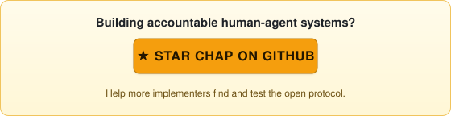
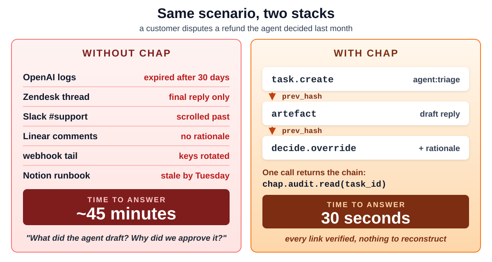
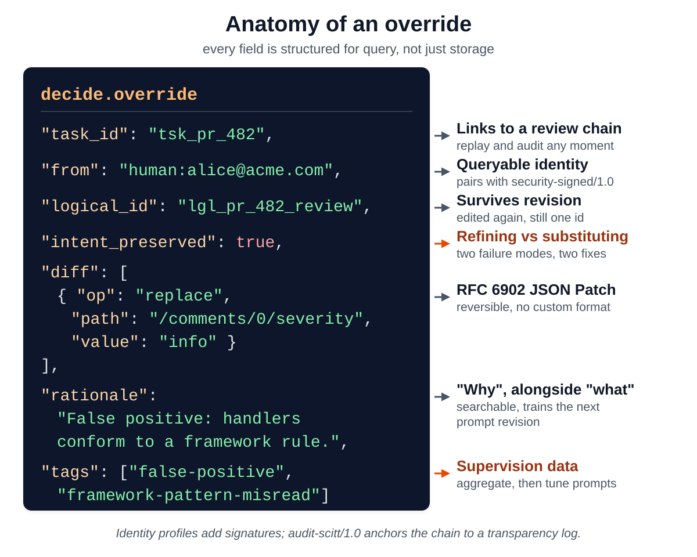

<div align="center">

# Collaborative Human-Agent Protocol (CHAP)

<p align="center">
  <a href="https://github.com/BrightbeamAI/chap/releases/latest"></a>
  <a href="https://pypi.org/project/chap-coordinator/"></a>
  <a href="https://www.npmjs.com/package/@brightbeamai/chap-coordinator"></a>
  <a href="https://github.com/BrightbeamAI/chap/actions/workflows/ci.yml"></a>
  <a href="https://github.com/BrightbeamAI/chap/blob/main/LICENSE-SPEC.md"></a>
  <a href="https://github.com/BrightbeamAI/chap/blob/main/LICENSE"></a>
</p>

<p align="center">
  <strong>The open protocol for humans and agents doing accountable work together.</strong>
</p>

<p align="center">
  CHAP gives approvals, overrides, handoffs and escalations one shared, auditable shape across MCP and A2A.
</p>

<p align="center">
  <a href="./START_HERE.md"><strong>Start here</strong></a> ·
  <a href="#concepts">Concepts</a> ·
  <a href="#install">Install</a> ·
  <a href="#the-90-second-tour">90-second tour</a> ·
  <a href="./examples/drive-chap-from-claude-desktop.md">MCP quickstart</a> ·
  <a href="./IN_PRACTICE.md">Scenarios</a> ·
  <a href="./IMPLEMENTATIONS.md">Implementations</a> ·
  <a href="https://github.com/BrightbeamAI/chap/wiki">Wiki</a> ·
  <a href="https://github.com/BrightbeamAI/chap/discussions">Discussions</a> ·
  <a href="https://arxiv.org/abs/2606.09751">Paper</a>
</p>

<p align="center">
  <a href="https://github.com/BrightbeamAI/chap">
    
  </a>
</p>

</div>

---

<p align="center">
  
</p>

---

Work is moving towards teams in which hundreds of agents and hundreds of people take part. Agents draft, triage and recommend; people approve, correct, overrule and escalate. Those human decisions make the work accountable, yet they are usually recorded only in chat threads, ticket comments and memory.

CHAP gives those decisions a defined structure and an auditable record: what the agent produced, what the person decided and why, in one log that can be queried and verified.

- **Structured overrides.** When a person edits an agent's work, the edit is recorded with a diff, a rationale and tags your team defines, so corrections can be analysed later.
- **A tamper-evident log.** Every change is recorded in order. With the hash chain on, an altered entry is detected on verification, provided a recent chain head is kept out of the operator's reach ([`SECURITY.md`](./SECURITY.md) §5). The history survives key rotation, expired vendor logs and staff changes.
- **Signatures and identity.** Optional extensions, called profiles, require every call to be signed, bind signing keys to verified identities, and submit entries to a transparency log.
- **Alongside MCP and A2A.** MCP connects agents to tools and A2A connects agents to each other; CHAP records the work agents share with people.

## Concepts

CHAP is a protocol: a set of calls that agents, people and their tools send to a **coordinator**, the service that mediates a workspace. The coordinator checks each call against the workspace's rules, answers it, and records each accepted change in the workspace's audit log. The TypeScript and Python packages below are coordinators, to embed in your own process or run as a server.

| Term | What it is |
|---|---|
| **Workspace** | A named context for one body of work: its members, its tasks, and the profiles it uses |
| **Participant** | A member, named by a URI such as `human:alice@example.org` or `agent:triage`; `group:` names a set of members |
| **Task** | A unit of work, assigned to a participant |
| **Artefact** | What a participant produces in a task: a draft, a decision, an override |
| **Envelope** | One call, as a JSON-RPC 2.0 message; its `method` is the verb, such as `task.create` or `decide.approve` |
| **Audit log** | The ordered record of every change to the workspace; with the hash chain on, each entry carries the hash of the one before it |

The verbs read as their names. A task is created, completed and sent for review (`task.create`, `task.complete`, `review.request`). A reviewer approves, rejects or overrides it (`decide.approve`, `decide.reject`, `decide.override`). Work is handed off or escalated (`handoff.propose`, `escalate.raise`), and `audit.read` returns the record.

**Core and profiles.** Every coordinator implements **Core** (`core/1.0`): workspaces, participants, tasks and the audit log. Everything else is an optional **profile**, named with its version. `review/1.0` adds review requests and decisions. Others add quick questions to a person (`whisper/1.0`), group votes (`deliberation/1.0`), handoffs (`handoff/1.0`), pausing and rollback (`control/1.0`), routing (`routing/1.0`), shadow and trial modes (`modes/1.0`), signed calls (`security-signed/1.0`), verified identities (`identity-oidc/1.0`, `identity-vc/1.0`) and a transparency log (`audit-scitt/1.0`). A workspace advertises the profiles it uses, and the coordinator refuses calls that belong to any other profile. [`core/SPEC.md`](./core/SPEC.md) fits Core on one page, [`profiles/PROFILES.md`](./profiles/PROFILES.md) lists the profiles, and [`GLOSSARY.md`](./GLOSSARY.md) defines every term.

## Install

**Libraries.** Each package implements Core and every profile; a new workspace advertises `core/1.0` and `review/1.0` unless you name others.

<table>
<tr><th>TypeScript</th><th>Python</th></tr>
<tr><td>

```bash
npm install @brightbeamai/chap-coordinator
```

</td><td>

```bash
pip install chap-coordinator
```

</td></tr>
</table>

**A new project.** [`create-chap-app`](./packages/create-chap-app/) generates one with a review desk, one profile setting and a `diff-profiles` command:

```bash
npx create-chap-app my-gate
cd my-gate && npm install && npm run demo
```

The default template is the code gate: each change a coding agent makes in a git repository is reviewed as a diff, approved with the reviewer's signature, and committed with the evidence beside it for CI to verify. The other templates are an MCP gate for Claude Desktop, Cursor and Claude Code, a support desk, an outbound approval gate and a production set. [`docs/profile-explorer.md`](./docs/profile-explorer.md) shows what each profile changes.

**From a clone of this repository.** [`START_HERE.md`](./START_HERE.md) runs a local review desk on the Python coordinator, with Python 3.10 or later and nothing else to install:

```bash
git clone https://github.com/BrightbeamAI/chap.git && cd chap
python3 start-here/start.py
```

[`examples/00-five-minute-start.md`](./examples/00-five-minute-start.md) sends envelopes to the Core reference server with `curl` and reads back the audit log. The libraries are in [`packages/coordinator/`](./packages/coordinator/) and [`packages/coordinator-py/`](./packages/coordinator-py/), the reference implementations in [`reference/`](./reference/) and [`reference/python/`](./reference/python/).

## The 90-second tour

A solo developer reviews pull requests with Cursor, and the bot flags a warning the developer disagrees with. The clip shows the exchange in six steps, in about 23 seconds.

<p align="center">
  
</p>

The code for each step follows, in TypeScript and Python.

<details>
<summary><b>1. Spin up a workspace</b>: a coordinator with SQLite and the hash chain, and two participants</summary>

<table>
<tr><th>TypeScript</th><th>Python</th></tr>
<tr><td valign="top">

```ts
import { Coordinator } from "@brightbeamai/chap-coordinator";
import { SqliteStore } from
  "@brightbeamai/chap-coordinator/storage/sqlite";

const coord = new Coordinator({
  store: new SqliteStore("./chap.db"),
  enableChain: true,
});

coord.api.workspace.create({
  workspace: "wsp_pr_reviews",
  profiles:  ["core/1.0", "review/1.0"],
});

coord.api.participant.join({
  workspace: "wsp_pr_reviews",
  from:      "human:me@local",
  type:      "human",
});

coord.api.participant.join({
  workspace: "wsp_pr_reviews",
  from:      "agent:cursor#v1",
  type:      "agent",
});
```

</td><td valign="top">

```python
from chap_coordinator import Coordinator
from chap_coordinator.storage.sqlite \
    import SqliteStore

coord = Coordinator(
    store=SqliteStore("./chap.db"),
    enable_chain=True,
)

def send(method, params):
    return coord.dispatch({
        "jsonrpc": "2.0", "id": method,
        "method": method, "params": params,
    })

send("workspace.create", {
    "workspace": "wsp_pr_reviews",
    "profiles":  ["core/1.0", "review/1.0"],
})

send("participant.join", {
    "workspace": "wsp_pr_reviews",
    "from":      "human:me@local",
    "type":      "human",
})

send("participant.join", {
    "workspace": "wsp_pr_reviews",
    "from":      "agent:cursor#v1",
    "type":      "agent",
})
```

</td></tr></table>

</details>

<details>
<summary><b>2. The bot drafts, you override</b>: your Cursor integration emits the envelopes</summary>

<table>
<tr><th>TypeScript</th><th>Python</th></tr>
<tr><td valign="top">

```ts
// The review Cursor returned.
const cursorReview = {
  comments: [{ severity: "warning",
               body: "Unused parameter." }],
};

// The bot's review is the output of a task.
const { task_id } = coord.api.task.create({
  workspace: "wsp_pr_reviews",
  from:      "agent:cursor#v1",
  assignee:  "agent:cursor#v1",
  kind:      "code_review",
  input:     { pr_id: "PR-482" },
});

coord.api.task.complete({
  workspace: "wsp_pr_reviews",
  from:      "agent:cursor#v1",
  task_id,
  output:    cursorReview,
});

coord.api.review.request({
  workspace: "wsp_pr_reviews",
  from:      "agent:cursor#v1",
  task_id,
  artefact:  cursorReview,
  to:        "human:me@local",
});

// You disagree with one comment. Override it.
coord.api.decide.override({
  workspace:        "wsp_pr_reviews",
  from:             "human:me@local",
  task_id,
  intent_preserved: true,
  diff: [{ op: "replace",
           path: "/comments/0/severity",
           value: "info" }],
  rationale: "False positive. Framework " +
             "convention, not a bug.",
  tags: ["false-positive",
         "framework-pattern-misread"],
});
```

</td><td valign="top">

```python
# The review Cursor returned.
cursor_review = {
    "comments": [{"severity": "warning",
                  "body": "Unused parameter."}],
}

# The bot's review is the output of a task.
r = send("task.create", {
    "workspace": "wsp_pr_reviews",
    "from":      "agent:cursor#v1",
    "assignee":  "agent:cursor#v1",
    "kind":      "code_review",
    "input":     {"pr_id": "PR-482"},
})
task_id = r["result"]["task_id"]

send("task.complete", {
    "workspace": "wsp_pr_reviews",
    "from":      "agent:cursor#v1",
    "task_id":   task_id,
    "output":    cursor_review,
})

send("review.request", {
    "workspace": "wsp_pr_reviews",
    "from":      "agent:cursor#v1",
    "task_id":   task_id,
    "artefact":  cursor_review,
    "to":        "human:me@local",
})

# You disagree with one comment. Override it.
send("decide.override", {
    "workspace":        "wsp_pr_reviews",
    "from":             "human:me@local",
    "task_id":          task_id,
    "intent_preserved": True,
    "diff": [{"op":    "replace",
              "path":  "/comments/0/severity",
              "value": "info"}],
    "rationale": "False positive. Framework "
                 "convention, not a bug.",
    "tags": ["false-positive",
             "framework-pattern-misread"],
})
```

</td></tr></table>

> **The two surfaces.** TypeScript ships a typed facade, `coord.api.*`, so every method has autocomplete and compile-time checks. Python keeps the JSON-RPC envelope on the surface, `coord.dispatch({...})`, wrapped here in a `send()` helper, the idiom the Python tests use. Both send the same parameters in the same envelope, so the audit chain reads the same whichever client made the call.

</details>

<details>
<summary><b>3. Two months in</b>: a script groups your overrides by tag, intent and reviewer</summary>

The repository ships the script in both languages. It reads the audit chain over HTTP or straight from your SQLite file:

```bash
# TypeScript reference, against the SqliteStore from step 1:
$ npx tsx reference/core-plus-review/analyze-overrides.ts --db ./chap.db wsp_pr_reviews

# Python reference, same idea:
$ python3 reference/python/analyze_overrides.py --db ./chap.db wsp_pr_reviews

Override Learning Report
========================================
Workspace:       wsp_pr_reviews
Total overrides: 47

By tag:
  false-positive                       ████████████████████   31  (66%)
  framework-pattern-misread            ██████████████          22  (47%)
  cosmetic-pref                        █████                    8  (17%)

Intent breakdown:
  refining (same decision, better wording)   41
  substituting (different decision)          6

Top reviewers:
  human:me@local                            47

Hint: the most common tags are your next prompt revision targets.
```

The most common tags name what the next prompt revision for Cursor should fix.

</details>

[`chap-analytics`](./packages/chap-analytics/) (`pip install chap-analytics`) loads the whole chain into documented pandas tables, from a SQLite file, a JSON export, a live coordinator or an `audit.read`: overrides, decisions, reviewers, whispers and handoffs. A [notebook](./packages/chap-analytics/examples/chap_analytics_walkthrough.ipynb) works through a week of review data, and [`ANALYTICS_ROADMAP.md`](./ANALYTICS_ROADMAP.md) describes the planned work.

## The override envelope

The override envelope records a reviewer's change to an agent's output. Each field is annotated below:

<p align="center">
  
</p>

Two fields matter most for analysis:

- **`intent_preserved`** tells a *refining* override, where the person kept the agent's decision and rewrote its wording, from a *substituting* one, where the person decided differently. Each points at a different fix: many refining overrides around one policy clause point at the agent's retrieval; many substituting ones point at an ambiguous policy, or at the agent's task context.
- **`tags`** are the small, controlled vocabulary your team agrees on. They are what you will count by three months from now, to answer *which prompts need work?* and *which paths does the bot keep getting wrong?*

## Status

CHAP 0.3 is a public draft: a small Core and optional profiles ([`SPECIFICATION.md`](./SPECIFICATION.md)).

- Two reference coordinators, in TypeScript and Python, implement the same methods, and a differential fuzzer checks that they answer and log alike.
- The conformance harness covers Core and `review/1.0`, and runs against the Python coordinator and a standalone TypeScript server.
- A coordinator can present itself as an [MCP](https://modelcontextprotocol.io) server or an [A2A](https://a2a-protocol.org) agent.
- Framework bridges put LangGraph, Pydantic AI, AG2, LlamaIndex Workflows and Google ADK human-in-the-loop decisions on the audit log.

Before 1.0, a minor release may break things, and its changelog lists each break with a migration; from 1.0 the specification follows [Semantic Versioning](./ROADMAP.md#version-numbers). For strict stability, wait for 1.0: [`ROADMAP.md`](./ROADMAP.md) sets out what it will promise and the milestones on the way.

## Read this next

| Read | For |
|---|---|
| [`START_HERE.md`](./START_HERE.md) | A local review desk on the Python coordinator, with nothing to install beyond Python |
| [`IN_PRACTICE.md`](./IN_PRACTICE.md) | Scenarios, from a solo developer with Cursor to GMP-regulated manufacturing |
| [`ABOUT.md`](./ABOUT.md) | The repository's contents, how CHAP relates to MCP and A2A, the standards it reuses, and contributing |
| [`core/SPEC.md`](./core/SPEC.md) | Core, on one page |
| [The technical report](https://arxiv.org/abs/2606.09751) | The architecture, profile semantics and threat model, with the scenarios as JSON traces |

## Cite

If you reference CHAP in academic or technical work, please cite the technical report.

<details>
<summary>BibTeX</summary>

```bibtex
@techreport{chap2026,
  author      = {Shahid, Arsalan and Suttie, Gordon and Black, Philip},
  title       = {Collaborative Human-Agent Protocol (CHAP): An open protocol for auditable, structured multi-human and multi-agent collaboration},
  institution = {Brightbeam AI},
  year        = {2026},
  type        = {Technical Report},
  number      = {arXiv:2606.09751},
  url         = {https://arxiv.org/abs/2606.09751}
}
```

</details>

---

CC BY 4.0 (specification text, see LICENSE-SPEC.md) · Apache 2.0 (everything else) · Any language, any deployment.
