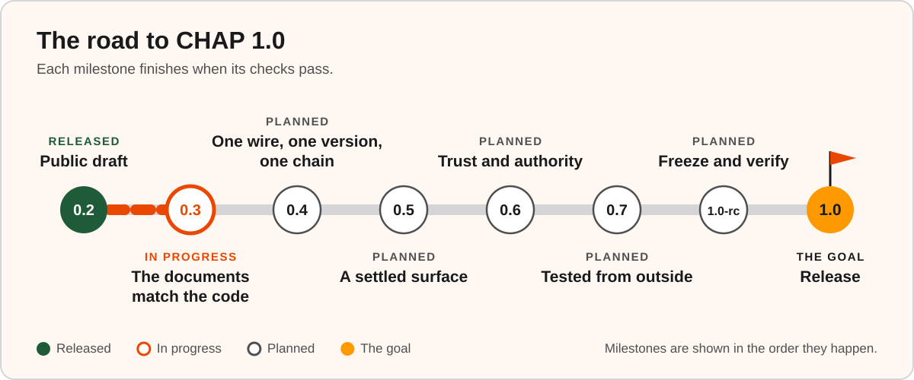
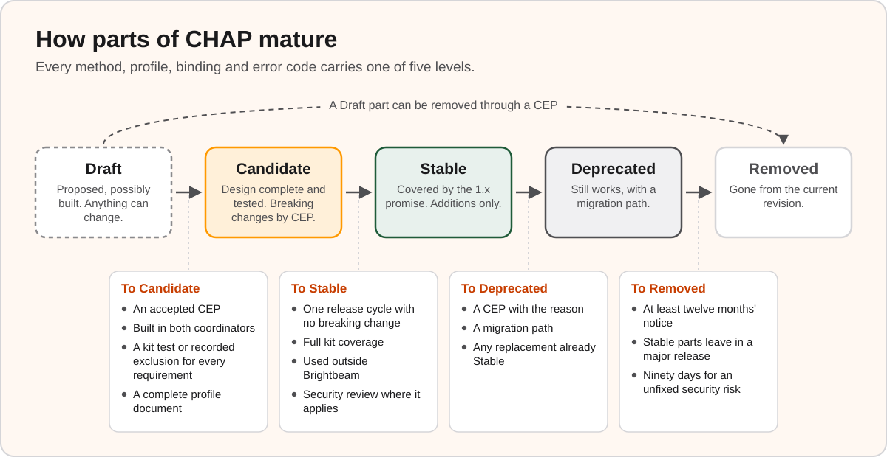
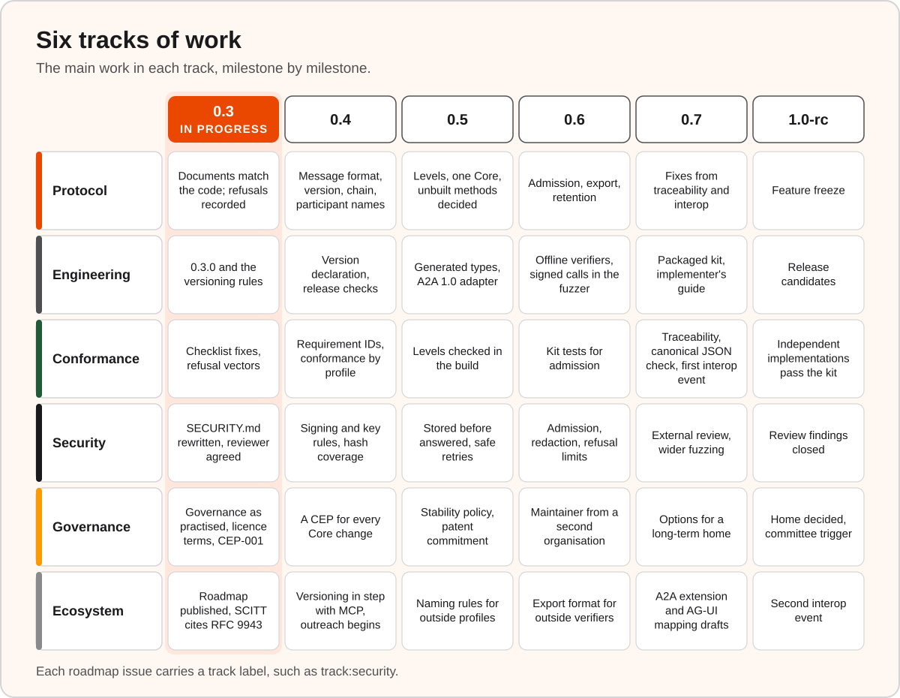
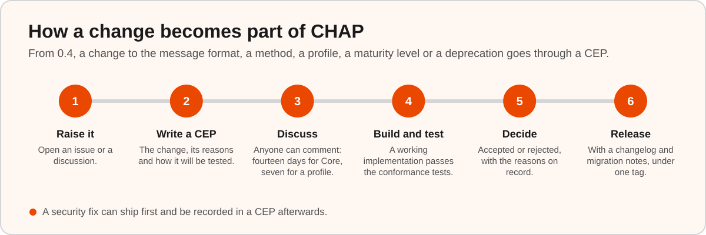

# CHAP roadmap

> Where CHAP stands today, what version 1.0 will promise, and the steps that lead there.

CHAP, the Collaborative Human-Agent Protocol, records how people and AI agents
share work. Each task, draft, review, correction and decision becomes an entry
in a workspace's audit log. Anyone with access to the log can read it later.
With the hash chain switched on, anyone who keeps a copy of a recent chain
head can later check that no entry before it has changed.

CHAP has a small Core that every implementation supports, and optional
profiles that add to it, such as review, control and whisper.
[Words used here](#words-used-here) explains these and the other terms on
this page.

CHAP 0.2 is a public draft. This roadmap sets out what CHAP 1.0 will promise
the people who build on it, the milestones that lead there, and how you can
take part.

The milestones happen in the order shown, and each one finishes when its
checks pass. The maintainers review this roadmap at every release and record
each change in the changelog. A change to [what 1.0 promises](#what-10-promises)
goes through a CHAP Enhancement Proposal (CEP).

**On this page**

- [At a glance](#at-a-glance)
- [Where CHAP stands today](#where-chap-stands-today)
- [What 1.0 promises](#what-10-promises)
- [The milestones](#the-milestones)
- [How parts of CHAP mature](#how-parts-of-chap-mature)
- [Version numbers](#version-numbers)
- [Six tracks of work](#six-tracks-of-work)
- [How decisions are made](#how-decisions-are-made)
- [Where CHAP fits](#where-chap-fits)
- [Open questions](#open-questions)
- [How to take part](#how-to-take-part)
- [Ideas borrowed from other protocols](#ideas-borrowed-from-other-protocols)
- [Words used here](#words-used-here)

## At a glance

| Milestone | Goal | Finished when |
|---|---|---|
| [**0.3** The documents match the code](#03-the-documents-match-the-code) | Every document describes what CHAP does today. | 0.3.0 is released, and the documents agree with the coordinators, apart from the gaps that later milestones close. |
| [**0.4** One wire, one version, one chain](#04-one-wire-one-version-one-chain) | Settle the message format (the wire), put a version on every request, and decide the audit chain. | The decisions are written down, built into both coordinators and tested. |
| [**0.5** A settled surface](#05-a-settled-surface) | Give every part of CHAP a maturity level, and agree one list of Core methods. | Every part carries a level, and every method is built or marked Draft. |
| [**0.6** Trust and authority](#06-trust-and-authority) | Decide who may join a workspace and act in it, and make audit logs portable. | Admission rules are enforced, and a log exported by either coordinator verifies with the other's offline verifier. |
| [**0.7** Tested from outside](#07-tested-from-outside) | A test kit anyone can run, an outside implementer running it, and an external security review. | Someone outside Brightbeam has run the kit, and the review has reported. |
| [**1.0-rc** Freeze and verify](#10-rc-freeze-and-verify) | Stop adding features, close the review findings, and test for a fixed period. | The period ends with no breaking change and every release blocker closed. |
| [**1.0** Release](#10-release) | Keep every promise in this roadmap. | Every promise's test passes. |

## Where CHAP stands today

### What works now

- **Two coordinators checked against each other.** A coordinator is the
  service that runs workspaces: it checks each call and keeps the log. CHAP
  has one written in TypeScript and one in Python. Both speak the same
  JSON-RPC 2.0 messages, a standard format for remote calls written in JSON.
  A fuzzer sends both coordinators the same generated calls, and the build
  fails if their answers or their logs differ. Signed calls join the fuzzer
  in 0.6. Modes and the SCITT profile, which sends log entries to an external
  transparency service, join it in 0.7.
- **An audit log you can check.** Each accepted call that changes something
  becomes an entry. With the hash chain switched on, each entry carries a hash
  of the one before it, so a change to an earlier entry shows up when the log
  is checked against a chain head kept outside the coordinator. From 0.3.0, a member's refused attempt at a governed action,
  such as approving a review addressed to someone else, is recorded too and
  marked as refused.
- **One list of methods.** A single catalogue says which profile owns each
  method. A script writes a copy into each coordinator, and the build fails if
  a copy falls out of date. From 0.3.0, a workspace serves the methods of the
  profiles it advertises, together with the read-only methods and the key
  management that every workspace keeps.
- **Shared test material.** The [`conformance/`](./conformance/) folder holds
  test vectors, which are fixed inputs with their expected outputs. They cover
  signatures, canonical JSON, numbers, patches, snapshots, the chain, the
  profile gate and refused calls. The folder also holds a test harness that
  runs against live servers, and a self-assessment checklist.
- **A change process in use.** [CEP-001](./ceps/CEP-001.md), written with the
  EMILIA Protocol project, lets a review decision carry a digest of the
  content it settles. When a decision carries the digest, the coordinator
  checks it against the content under review, so the log shows exactly what
  the person approved. Both coordinators implement it. People outside Brightbeam have contributed fixes
  and integration notes.
- **Connections to other tools.** A coordinator can act as a server for the
  Model Context Protocol (MCP), so AI agents can use CHAP as a set of tools.
  It can also act as an agent in the Agent2Agent protocol (A2A), so other
  agents can work with it. Python bridges carry human decisions from
  LangGraph, Pydantic AI, LlamaIndex, AG2 and Google ADK onto the log, and
  `chap-analytics` reads logs back as tables and charts.
- **A written threat model** in [SECURITY.md](./SECURITY.md), which the
  specification points to, with private vulnerability reporting.

### What still needs work

![Known gaps on a board with one column per milestone. 0.3, the milestone in progress: version numbers, governance documents, smaller mismatches. 0.4: two message descriptions, no version on requests, an optional and partial chain, conformance levels, participant names. 0.5: two lists of Core methods, no maturity labels, safe retries, calls answered and never stored, the A2A adapter on A2A 0.3, a patent commitment. 0.6: unbuilt methods, open joining, refusal records, one maintaining organisation. 0.7: test coverage. Release candidate: implementations from one team, no outside security review. After 1.0: known security limits. A "from" label marks a gap whose work starts in an earlier milestone.](docs/img/roadmap-gaps-to-milestones.svg)

These are the known gaps between the draft and 1.0, grouped by the milestone
that closes them. Where the work spans more than one milestone, the table says
where it starts and where it closes.

| Gap | What it means | Milestones |
|---|---|---|
| Version numbers and the release policy disagree | Patch releases in the 0.2 series carried behaviour changes. The next release is 0.3.0, and it writes the versioning rules down. | 0.3 |
| The governance documents describe bodies yet to form | GOVERNANCE.md gives decisions to a steering committee and working groups that have yet to form, and lets only that committee amend the document. Editorial notes in GOVERNANCE.md and CONTRIBUTING.md point to MAINTAINERS.md for current practice. | 0.3 |
| Smaller mismatches between text and code | The documents and the coordinators differ in a number of smaller places. The 0.3 sweep corrects each one and publishes the list. | 0.3 |
| Two descriptions of the messages | core/SPEC.md describes the JSON-RPC messages both coordinators send. Parts of SPECIFICATION.md describe a different message shape. | 0.4 |
| No protocol version on requests | A client has no way to ask which revision a coordinator speaks, and the log has no record of which rules applied to an entry. | 0.4 |
| The chain is optional and partly hashed | A profile or an option switches the hash chain on. Where it is on, an entry's sequence number and arrival time sit outside the hash. | 0.4 |
| Conformance levels that cannot be met | The conformance levels in SPECIFICATION.md §17 require methods that are specified and still unbuilt. | 0.4 |
| The format of participant names is unsettled | CHAP names participants with URIs such as `human:alice@example.org`. The `service` prefix is already registered as a URI scheme for another purpose, and the guidance on new schemes ([RFC 7595](https://www.rfc-editor.org/rfc/rfc7595)) discourages general-purpose names. | 0.4 |
| Two lists of Core methods | core/SPEC.md and the catalogue list different sets of methods as Core. | 0.5 |
| No maturity labels | Every profile name ends in `/1.0`, such as `review/1.0`, and none says how stable it is. | 0.5 |
| Safe retries cover one method | `task.create` is the one method that takes an idempotency key. A client that retries another call after a timeout cannot tell whether the first attempt took effect. | 0.5 |
| A call can be answered and never stored | Both coordinators answer a call whether or not its write to storage succeeds. The TypeScript coordinator can report a failed write to the application that hosts it, and the Python coordinator ignores it. | 0.5 |
| The A2A adapter speaks A2A 0.3 | The TypeScript A2A adapter implements A2A 0.3, and A2A has since reached 1.0. | 0.5 |
| No written patent commitment | GOVERNANCE.md §5.4 states that CHAP should be implementable royalty-free. The formal patent policy it refers to has yet to be written. | 0.5 |
| Specified methods still unbuilt | Some methods that the rest of the specification relies on, such as closing a workspace, exporting a log and redacting an entry, have no implementation yet. | Decided in 0.5, closed in 0.6 |
| Anyone can join a workspace | Joining admits any caller in the role it asks for, and creates the workspace if it does not exist. Methods carry permission scopes that nothing enforces yet. | 0.6 |
| Refusal records cannot yet prove the sender | A refusal names the member the call claimed to come from. Until joining and signing are settled, a call can claim to come from a member who never sent it. | 0.6 |
| One organisation maintains CHAP | Every maintainer works for Brightbeam. | 0.6 |
| Testing covers part of the protocol | The fuzzer leaves out signing, modes and the SCITT profile. The conformance harness runs against a server built on the Python coordinator and a standalone TypeScript server for Core and review, and has yet to run against the TypeScript coordinator package. | Starts in 0.4, closed in 0.7 |
| One team wrote every implementation | Both coordinators and every package come from Brightbeam. | Starts in 0.7, closed at 1.0-rc |
| No outside security review yet | The canonical JSON, signing, chain, admission and key-handling code has had no external review. | Reviewed in 0.7, closed at 1.0-rc |
| Known security limits | Three of the limits in SECURITY.md §8 remain after 1.0. Anyone who can read the log can read its content. The signatures (Ed25519) would not withstand a future quantum computer. A key revoked in one workspace stays valid in others unless the deployment passes the revocation on. | After 1.0, as Draft profiles |

## What 1.0 promises

CHAP 1.0 is a set of promises to the people who build on CHAP, run it and
audit it. Each promise comes with the test that shows it holds, and 1.0 ships
when every test passes.

**1. The specification describes the messages.**

One authoritative description of the message format, the audit entry and the
chain formula, matching what the coordinators produce.

*How we check:* the build validates recorded traffic from both coordinators,
the harness and the fuzzer against the published schemas.

**2. Every request says which CHAP it speaks.**

A request declares its protocol version. A coordinator answers a version
outside its range with a refusal that lists the versions it supports. The
declaration is recorded with the request, so the log shows which rules
applied to each entry.

*How we check:* kit tests for the declaration, the refusal and version
discovery.

**3. Stable parts keep their contract for all of 1.x.**

Core and every Stable profile keep their methods, parameters, results, error
codes and state machines for the life of 1.x, and a Stable binding keeps the
way it carries messages. A Stable part can be deprecated
with a migration path and at least twelve months' notice, and removed only in
2.0. The one exception is a part with an active security risk and no fix in
place, which can be removed after at least ninety days' notice.

*How we check:* a build step compares each release with the one before and
fails on an unmarked breaking change, and the previous release's kit runs
against the new release.

**4. Every requirement has a test.**

Each MUST, SHOULD or similar requirement in Core and the Stable profiles maps
to a kit test, or to a recorded reason why it cannot be tested. A
traceability file for each section records the mapping.

*How we check:* complete traceability files, and a kit report that shows the
coverage of each section.

**5. Implementations written apart work together.**

Coordinators written by separate teams pass the kit for Core and the review
profile, and at least one of them comes from outside Brightbeam. A log
exported by any implementation verifies with the others' verifiers. Each
implementation's canonical JSON matches an independent RFC 8785
implementation. Milestone 0.5 settles how many independent implementations
1.0 needs.

*How we check:* published kit reports and a recorded interoperability run.

**6. Someone independent has checked the security claims.**

An external review covers canonical JSON, signing, the chain and its
verification, admission and authorisation, key rotation and revocation, patch
application, and restoring from storage.

*How we check:* a public report or summary. Every high or critical finding is
fixed, and every other finding is fixed or published with a mitigation.

**7. The governance documents describe how decisions are made.**

Maintainers come from at least two organisations. From 0.4 onward, every
change to Core or a Stable profile, apart from editorial changes, has an
accepted CEP with its reasons on record. The licence and patent terms are
written down and agree.

*How we check:* MAINTAINERS.md, the CEP index, the decision records and the
licence files.

**8. The specification and the code ship together.**

Each specification release comes with reference packages, a kit release, a
changelog and migration notes under one tag.

*How we check:* a release checklist that the build enforces.

### What the promise covers

The promise covers Core and every Stable profile and binding. Other parts of
CHAP follow their own path:

- **Profiles at Candidate or Draft** can ship alongside 1.0 and keep
  maturing.
- **Bindings.** HTTP is the binding the kit tests for 1.0. The MCP and A2A
  bindings can reach Stable once the kit runs over them and they meet the
  rules for Stable. The WebSocket,
  server-sent events and message broker bindings stay Draft until both
  coordinators implement them and the kit tests them.
- **Encrypted log content, quantum-resistant signatures and key revocation
  across workspaces** become Draft profiles after 1.0.
- **The framework bridges and `chap-analytics`** keep their own version
  numbers and say which specification versions they read.

## The milestones

Each milestone below has a goal, the work it contains, and the checks that
finish it. The checks are written as a list so progress can be ticked off in
public.

### 0.3: The documents match the code

**Goal:** every document describes what CHAP does today.

**The work**

- Release the work now on the main branch as 0.3.0. It includes the profile
  gate, which refuses a method whose profile a workspace does not advertise,
  and the recording of refused attempts.
- Write the versioning rules into the changelog, GOVERNANCE.md and
  CONTRIBUTING.md.
- Add a note to SPECIFICATION.md §4.1 and §5.2 that points to core/SPEC.md §2
  as the description of today's messages, until 0.4 settles the format.
- Rewrite SECURITY.md to match the specification and the coordinators, and
  make it the one threat model that the specification points to.
- Check the specification, core/SPEC.md, the profile documents and the
  checklist against the coordinators. Correct each mismatch, and publish the
  list.
- Correct IMPLEMENTATIONS.md, which labels the coordinators and adapters
  Stable and claims full 0.2 conformance for both coordinators. Add a column naming the harness
  version each claim was tested with.
- Rewrite GOVERNANCE.md and CONTRIBUTING.md to describe the process the
  maintainers follow. GOVERNANCE.md §8 requires a steering committee that has
  yet to form, so the maintainers adopt the rewrite once, through a CEP with
  the twenty-one-day comment period that §8 sets.
- Make the licence terms agree in LICENSE, the README, GOVERNANCE.md and
  CONTRIBUTING.md.
- Take CEP-001 to Accepted.
- Open CEPs for the message format, for versioning and for the chain.
- Update the `audit-scitt` profile to cite the SCITT architecture, published
  as RFC 9943.
- Agree who carries out the external security review, and how it is paid for.
- Publish this roadmap, with GitHub milestones for its work and a track label
  on each roadmap issue.

**Finished when**

- [ ] 0.3.0 is tagged and published, and its changelog lists every breaking
      change with a migration.
- [ ] The documents agree with the coordinators, apart from the gaps that
      later milestones close. The release notes record the sweep.
- [ ] GOVERNANCE.md and CONTRIBUTING.md describe the process in use, and the
      licence terms agree.
- [ ] CEP-001 is Accepted.
- [ ] The message format, versioning and chain CEPs are open for comment.
- [ ] The external reviewer and the funding for the review are agreed.

### 0.4: One wire, one version, one chain

**Goal:** settle the message format (the wire), put a version on every
request, and decide the audit chain.

**The work**

- **The message format.** A CEP adopts the JSON-RPC 2.0 form described in
  core/SPEC.md §2 across the whole specification. It covers request and
  response shapes, the CHAP fields inside `params`, the signature (how it is
  encoded and what it covers) and the rules for request ids. A new schema
  describes the format, and the build checks recorded traffic against it.
- **Keys and errors.** The same CEP sets one rule for choosing a signing key.
  A coordinator judges revocation and expiry by its own clock, and uses the
  sender's timestamp only to choose the key. The CEP also sets the HTTP status
  for each kind of error, and says which errors a client may safely retry.
- **Unknown parameters.** A coordinator that skips a parameter it does not
  know can leave a caller believing something was checked. The CEP chooses
  between two answers: refuse every unknown parameter, or let a sender mark
  the parameters a coordinator must understand. Either way, a client can spot
  a coordinator too old to honour them.
- **Versioning.** Each request declares its protocol version. A refusal lists
  the versions a coordinator supports, and `workspace.describe` reports them
  with the workspace's profile versions. The declaration is recorded with the
  request. The design follows the per-request versioning of MCP. Until 1.0, a
  request with no declaration is served under the workspace's own version,
  which `workspace.describe` reports. From 1.0 the declaration is required.
- **The chain.** A CEP decides whether every workspace keeps a hash-linked
  chain from its first entry as part of Core, and what the hash covers. If the
  formula changes, each entry records which formula applies to it, so logs
  written under earlier versions keep verifying. If the chain becomes part of
  Core, `audit.verify_chain` moves to Core with it.
- **Participant names.** CHAP names participants with URIs such as
  `human:alice@example.org` and `agent:triage-bot`. This milestone settles the
  format, because every stored log carries it.
- **Conformance by profile.** A conformance claim names the specification
  version, Core, the profiles and the kit version, and attaches the kit
  report. This replaces the levels in SPECIFICATION.md §17.
- **Release checks.** A build step compares the catalogue, schemas and error
  tables with the last release. It fails the build on a breaking change the
  changelog does not list. A release checklist runs in the build from this
  release on, and the harness runs against both coordinator packages. Each
  release also measures how fast entries are added and verified, so a
  slowdown shows.
- **Requirement identifiers** for every requirement in Core, ready for the
  traceability work in 0.7.
- **Outreach begins.** The implementer's guide starts, and the maintainers
  approach people who might build a second coordinator.

**Finished when**

- [ ] The message format, versioning and chain CEPs are Accepted, and the
      format of participant names is decided.
- [ ] The specification and core/SPEC.md describe what the coordinators do,
      and the message schema validates all harness and fuzzer traffic from
      both.
- [ ] Both coordinators record and check the version declaration, and the kit
      tests it.
- [ ] Logs stored under 0.2 and 0.3, refusal entries included, verify with
      the 0.4 coordinators from their first chained entry.
- [ ] The breaking-change check and the release checklist run in the build,
      and the harness runs against both coordinator packages.

### 0.5: A settled surface

**Goal:** every part of CHAP says how settled it is, and Core has one list of
methods.

**The work**

- **The stability policy.** A CEP sets out five maturity levels, what it takes
  to move between them, a twelve-month deprecation period, a public register
  of deprecations, and naming rules for profiles written outside this
  repository. See [How parts of CHAP mature](#how-parts-of-chap-mature).
- **Levels applied.** Every method, profile, binding and error-code range
  carries a level. The level appears in the catalogue, the profile documents
  and the specification's tables.
- **One Core.** core/SPEC.md and the catalogue agree on a single list of Core
  methods.
- **Generated tables and types.** The catalogue, which already produces each
  coordinator's list of methods, grows to produce the specification's method
  tables and the parameter types in both coordinators.
- **Unbuilt methods decided by the job they do.** One CEP decides each method
  that is specified and still unbuilt. Methods that serve admission, key
  discovery, export, checkpoints (signed summaries of the log), redaction or
  closing a workspace stay as Draft until they are built. The rest are
  removed, unless someone shows a deployment that needs one.
- **Safe retries.** Every method that changes state accepts an idempotency
  key, so a client can retry after a timeout and get one result.
- **Stored before answered.** A CEP decides whether a coordinator must store
  a call before it answers. Storage gains tests for crashes and restarts.
- **Notifications.** The milestone decides whether 1.0 includes a way to
  deliver notifications, or leaves delivery to each deployment.
- **A patent commitment.** A written royalty-free patent commitment, in place
  before outside implementers commit to building.
- **A current A2A adapter.** The TypeScript A2A adapter moves to A2A 1.0.
- **The bar for 1.0.** A CEP settles how many independent implementations 1.0
  needs. CONTRIBUTING.md asks for three today.

**Finished when**

- [ ] The stability CEP, the CEP on unbuilt methods and the CEP on
      independent implementations are Accepted.
- [ ] Every catalogue entry, profile, binding and error-code range carries a
      level, and the build fails on one without.
- [ ] core/SPEC.md and the catalogue give the same list of Core methods.
- [ ] The catalogue produces the specification's method tables and both
      coordinators' parameter types.
- [ ] Every method is built in both coordinators or marked Draft.
- [ ] The retry, storage and notification decisions are built in both
      coordinators.
- [ ] The patent commitment is published.
- [ ] The TypeScript A2A adapter implements A2A 1.0.

### 0.6: Trust and authority

**Goal:** decide who may join a workspace and act in it, and make audit logs
portable.

**The work**

- **Admission and authorisation.** A CEP defines who may join a workspace and
  in which role, and who grants roles. It also defines how a participant's
  name binds to an authenticated caller or to a signature, and settles the
  permission scope on each method.
- **What a refusal record proves.** Refused attempts are recorded from 0.3.0.
  The admission CEP also limits how fast one member can add refusals, and
  says what a refusal record proves once names bind to authenticated callers.
- **Portable logs.** An export format that carries the entries and the key
  history a verifier needs, a way to discover the keys of live participants,
  and an offline verifier in each implementation.
- **Retention and privacy.** How redaction works alongside verification, and
  what personal data participant names and reviewers' reasons carry.
- **Signed calls in the fuzzer.** The fuzzer sends signed calls to both
  coordinators, including copies of calls already on the log.
- **A second organisation.** A written path leads from contributor to
  maintainer, and a maintainer from a second organisation joins, chosen for
  sustained contribution.

**Finished when**

- [ ] The admission CEP is Accepted.
- [ ] Admission and authorisation work the same way in both coordinators,
      with tests.
- [ ] Every method kept in 0.5 is built in both coordinators, with kit tests.
- [ ] A log exported by either coordinator verifies with the other's offline
      verifier, redacted entries included.
- [ ] The fuzzer covers signed calls, including copies of calls already on
      the log.
- [ ] A maintainer from a second organisation has joined.

### 0.7: Tested from outside

**Goal:** anyone can test an implementation, someone outside Brightbeam has
done so, and an external review has checked the security.

**The work**

- **The compatibility kit.** The harness becomes a packaged kit that tests any
  CHAP endpoint over HTTP, writes a machine-readable report and versions with
  the specification. Runs over MCP and A2A follow.
- **Traceability.** Each requirement maps to a kit test or to a recorded
  exclusion with its reason, in the format MCP uses for its conformance
  tests. Core and the review, security-signed and control profiles come
  first.
- **An independent check on canonical JSON.** The build compares both
  coordinators' canonical JSON with at least one independent RFC 8785
  implementation. The shared vectors include text outside ASCII and very
  large numbers.
- **Wider fuzzing.** Property-based tests for canonical JSON, patch
  application and the state machines. Fuzzing of the message parser. The
  fuzzer that compares the coordinators extends to modes and the SCITT
  profile.
- **The external security review** runs on the code that 0.6 completes, so
  its findings arrive before the feature freeze.
- **Fixes.** Where traceability, the interop event or the review shows that
  the text is unclear or wrong, a CEP corrects it before the freeze.
- **The implementer's guide**, tried by someone who has never read the
  reference code.
- **Outreach.** The teams behind existing integrations, agent frameworks and
  research groups are invited to build or verify. The list of people building
  is public.
- **The first interop event.** Clients from one implementation drive a
  coordinator from another, and each verifies the logs the others export. The
  results are published.
- **Ecosystem drafts:** an A2A extension that carries review and whisper
  requests, and a mapping to AG-UI interrupts. These run alongside the
  milestone and leave its finish checks unchanged.

**Finished when**

- [ ] Traceability covers Core and the review, security-signed and control
      profiles in full.
- [ ] The kit reports full coverage for those four against both coordinators.
- [ ] Canonical JSON matches the independent implementation on every shared
      test vector.
- [ ] The fuzzer covers modes and the SCITT profile.
- [ ] At least one implementer outside Brightbeam has run the kit and
      published the report.
- [ ] The first interop event has run and its results are public.
- [ ] The security review has delivered its findings.

### 1.0-rc: Freeze and verify

**Goal:** stop adding features, close the review findings, and test for a
fixed period.

**The work**

- Feature freeze for Core and the profiles proposed as Stable. From the first
  release candidate, only fixes and clarifications land.
- Every high or critical review finding fixed, every other finding fixed or
  published with a mitigation, and the fixes checked by the reviewer.
- Governance for 1.0: maintainers from at least two organisations, the
  steering committee formed if its trigger has been met, a decision on the
  project's long-term home, and a succession plan for maintainers.
- A second interop event.
- A verification period of at least sixty days. Its length and finish checks
  are published at the first release candidate.

**Finished when**

- [ ] The independent implementations that 0.5 asks for pass the kit for
      Core and the review profile, and logs verify across implementations.
- [ ] The security review is complete, with no high or critical finding
      open.
- [ ] Every issue labelled `1.0-blocker` is closed.
- [ ] The verification period has run its full length with no breaking
      change.
- [ ] Maintainers come from at least two organisations.
- [ ] The decision on CHAP's long-term home is published.

### 1.0: Release

1.0 ships when every test under [What 1.0 promises](#what-10-promises)
passes. One tag carries the specification, the schemas, both coordinators,
the kit, the traceability report, migration notes from 0.x and the summary of
the security review.

### After 1.0

- Minor releases add profiles, and move a Candidate to Stable after one minor
  release at Candidate.
- Draft profiles for encrypted log content, quantum-resistant signatures and
  key revocation across workspaces, and a WebSocket binding built in both
  coordinators.
- The SCITT profile moves up once it adopts SCRAPI, the transparency service
  API from the Internet Engineering Task Force (IETF), and has run against
  transparency services from more than one operator.
- An Internet-Draft describing the audit chain and its SCITT mapping, if IETF
  review would help adopters.

## How parts of CHAP mature

Every method, profile, binding and error code carries one of five levels. A
parameter takes its method's level unless its schema says otherwise.

| Level | What it means | What can change |
|---|---|---|
| **Draft** | Proposed, and possibly built. | Anything, through a CEP, in any minor release. A Draft part can be removed. |
| **Candidate** | Design complete, built in both coordinators, covered by the kit. | Breaking changes through a CEP only, listed under "Breaking" in the changelog. |
| **Stable** | Covered by the 1.x promise. | Additions only. |
| **Deprecated** | Still works, with a published migration path. | Removal after at least twelve months. A Stable part is removed only in a major release, apart from the security exception in promise 3. |
| **Removed** | Gone from the current revision, still documented in the last revision that had it. | Nothing. |

**Draft to Candidate** takes an accepted CEP, a build in both coordinators, a
kit test or recorded exclusion for every requirement, and a complete profile
document.

**Candidate to Stable** takes one full release cycle at Candidate with no
breaking change, complete kit coverage, and use outside Brightbeam, by an
implementation or by a deployment that reports back. For 1.0 that cycle is
the release candidate period. After 1.0 it is one minor release. A part that
affects security also needs the external review.

**Deprecation** takes a CEP that names the part, the reason, the migration
path and the earliest removal. The catalogue, the specification and a public
register of deprecations then say so. Any replacement reaches Stable before
the part it replaces is deprecated.

### Proposed levels at 1.0

These are proposals. Milestone 0.5 decides each one through a CEP.

| Part | Proposed level at 1.0 | Condition |
|---|---|---|
| Core | Stable | Required for 1.0. Its method list is settled in 0.5. |
| HTTP binding | Stable | The binding the kit tests for 1.0. |
| `review/1.0` | Stable | Required for 1.0, after CEP-001 is accepted. |
| `security-signed/1.0` | Stable | The integrity claims rest on it. |
| `control/1.0` | Stable | Traceability complete at 0.7 and no behaviour change during the release candidate. Candidate otherwise. |
| `handoff/1.0`, `whisper/1.0`, `deliberation/1.0`, `modes/1.0`, `routing/1.0` | Candidate | Traceability complete before the first release candidate. Draft otherwise. |
| `audit-scitt/1.0` | Draft | Waits for SCRAPI, the IETF transparency service API it would adopt. |
| `identity-oidc/1.0`, `identity-vc/1.0` | Draft | The coordinators offer verification hooks, and each deployment supplies the verifier. |

## Version numbers

### Before 1.0

- A minor release (0.3, 0.4 and so on) may break things. Its changelog lists
  every breaking change under a "Breaking" heading with a migration.
- A patch release brings an implementation into line with the specification
  or corrects documentation. A change to what the specification requires is a
  minor release.
- The protocol packages take the specification's minor version: packages 0.3.x
  implement specification 0.3.

### From 1.0

- The specification follows Semantic Versioning: 1.x releases add, and 2.0
  removes.
- Profiles have their own version numbers. A workspace advertises profile
  versions, and the profile gate matches the major version. A workspace
  advertising `review/1.1` therefore serves a client written for
  `review/1.0`.
- A breaking change to a Stable profile takes a new major version, such as
  `review/2.0`. A workspace can advertise it beside `review/1.x` while
  clients move across.
- Packages have their own version numbers, and each package states the
  specification versions it implements.
- Security and defect fixes land on the latest 1.x minor release.

## Six tracks of work

The work runs in six tracks. Each roadmap issue carries a track label, so you
can follow the parts you care about.

**Protocol.** New capability arrives as a profile at Draft, and an addition
to Core makes its case in a CEP. Logs written under earlier versions keep
verifying. Any
change to the chain formula or to canonical JSON is versioned and made
through a CEP. Where the text and the coordinators differ, a CEP records
which one changes and why. From 0.4, each new requirement arrives with its
kit test or a recorded exclusion.

**Engineering.** Each specification release ships with its packages and a
kit release under one tag. During 0.5, the catalogue grows to produce the
specification's method tables and the parameter types in both coordinators. In the same milestone the A2A adapter moves to A2A 1.0, and the
MCP adapter keeps following the current MCP revision. The fuzzer grows to
cover signing, modes, the SCITT profile and every Candidate and Stable
method. Storage gains tests for crashes and restarts, and stored logs move
across versions with every entry intact. Each release measures how fast
entries are added and verified, so a slowdown shows.

**Conformance.** Every conformance claim cites a kit report. The kit runs
against any endpoint, reports on each requirement, and pins its version so a
claim can be repeated. Traceability files tie each requirement to a test.
Interop events test implementations whose authors have worked separately.

**Security.** The threat model in the specification and SECURITY.md becomes
one document, versioned with the specification. A reviewer independent of
Brightbeam is chosen in 0.3, carries out the review in 0.7 and checks the
fixes at the first release candidate. Wider fuzzing arrives in 0.7. Private
reporting continues, advisories follow fixes, and fixes land on the latest
minor release.

**Governance.** The governance documents describe the process the
maintainers follow. Every decision on Core and the Stable profiles goes
through a CEP, and its reasons are kept. The maintainer team grows beyond one
organisation. See [How decisions are made](#how-decisions-are-made).

**Ecosystem.** CHAP works alongside MCP, A2A and SCITT today, and 0.7
drafts a mapping to AG-UI. See [Where CHAP fits](#where-chap-fits).

## How decisions are made

**From 0.3.** The rewritten GOVERNANCE.md describes the process the
maintainers follow. Protocol decisions rest with the maintainer named for
them in MAINTAINERS.md. From 0.4, a change to the message format, a method, a
profile, a maturity level or a deprecation needs a CEP, and an editorial
change needs one maintainer's approval. Comment periods last fourteen days
for a change to Core and seven for a change to a profile. GOVERNANCE.md sets
thirty days for a change to Core today. As GOVERNANCE.md already requires, a
CEP can be accepted only after a working implementation passes the
conformance tests. A security fix may ship first and be recorded in a CEP
afterwards. Every CEP, accepted or rejected, keeps its decision and its
reasons.

**From 0.4 to 0.7.** A written royalty-free patent commitment arrives by
0.5, before outside implementers commit to building. A maintainer from a
second organisation joins in 0.6, chosen for sustained contribution. A
written path leads from contributor to maintainer. A working group forms once
a topic draws contributors from more than one organisation.

**For 1.0.** The rewritten GOVERNANCE.md sets when the steering committee
forms: once at least three organisations ship implementations or run CHAP in
production.
Until then, the maintainers publish each decision with its reasons, as
GOVERNANCE.md asks of the committee. A succession plan says what happens when
a maintainer steps down.

**A long-term home.** CHAP can stay in the Brightbeam organisation under this
governance, or join a vendor-neutral foundation, with Brightbeam staying on as
a lead maintainer. A move needs maintainers from a second organisation, a
review of the name and trademarks, and contribution terms the foundation
accepts. The options are assessed during 0.7, and the decision is made at the
release candidate.

## Where CHAP fits

CHAP records the human side of work that agents do. It sits beside the
protocols that agents already use.

- **MCP, the Model Context Protocol.** A coordinator can run as an MCP
  server, so an agent can open tasks, request reviews and read the log as
  tools. MCP declares its protocol version on every request
  ([versioning](https://modelcontextprotocol.io/specification/versioning)).
  CHAP's
  versioning follows the same pattern, so a client that speaks both handles
  versions the same way.
- **A2A, the Agent2Agent protocol.** A coordinator can run as an A2A agent.
  In September 2026, A2A's technical steering committee agreed that
  structured requests for input, which A2A calls elicitations, should be
  handled by an extension for now
  ([a2aproject/A2A#2149](https://github.com/a2aproject/A2A/pull/2149)).
  CHAP's review and whisper profiles are requests of that kind, with a
  recorded decision. Milestone 0.7 drafts an A2A
  extension that carries them, following A2A's extension process.
- **AG-UI, the Agent-User Interaction protocol.** The AG-UI 1.0 proposal
  defines interrupts and resumption for front ends. Milestone 0.7 drafts a
  mapping from review and whisper to AG-UI interrupts, so a front end can
  raise a CHAP decision and send back the answer.
- **SCITT, the IETF's Supply Chain Integrity, Transparency and Trust
  architecture.** The `audit-scitt` profile builds a SCITT statement for each
  entry and hands it to a transparency service through a hook that each
  deployment supplies. From 0.3 the profile cites the SCITT architecture,
  published as [RFC 9943](https://www.rfc-editor.org/rfc/rfc9943). It adopts
  [SCRAPI](https://datatracker.ietf.org/doc/draft-ietf-scitt-scrapi/), the
  transparency service API, once that is published.
- **Agent payments.** AP2 (the Agent Payments Protocol) and Verifiable
  Intent, contributed to the FIDO
  Alliance, define signed credentials for what a user authorised an agent to
  do in a payment. A signed CHAP decision carrying CEP-001's digest records
  what a participant approved. A note will compare the two once CEP-001 is
  accepted.
- **The implementations list.** [IMPLEMENTATIONS.md](./IMPLEMENTATIONS.md)
  takes new entries with a kit report attached.

## Open questions

These decisions are still open. The table gives the maintainers' current
leaning and the milestone that settles each one. Each is decided through a
CEP, open for comment like any other.

| Question | Current leaning | Settled in |
|---|---|---|
| Should every workspace keep a hash-linked chain as part of Core? | Yes, from the first entry, with the hash covering the whole entry under a versioned formula. A chain lets anyone who kept an earlier chain head check that no entry before it has changed, at the cost of one hash per entry. | 0.4 |
| Where does a request declare its version? | Inside `params`, so the log records it. An HTTP header may repeat it, and the `params` value decides. | 0.4 |
| How should a coordinator treat a parameter it does not know? | The sender lists the parameters a coordinator must understand, as the `crit` header does in JSON Web Signatures ([RFC 7515](https://www.rfc-editor.org/rfc/rfc7515#section-4.1.11)). | 0.4 |
| Who may join a workspace, and in which role? | An admin grants any role above the default, joining stops creating workspaces, and a participant's name binds to the authenticated caller or to a signature. | 0.6 |
| How many independent implementations does 1.0 need? | Two coordinators written separately, with the two reference coordinators counting as one, and verification of exported logs by a verifier written outside Brightbeam. CONTRIBUTING.md asks for three today, so this change would go through a CEP. | 0.5 |
| Where should CHAP live long term? | A vendor-neutral foundation, with Brightbeam staying on as a lead maintainer. | 1.0-rc |
| Should CHAP keep its name? | Review the name before any IETF submission or move to a foundation. "CHAP" is also the name of an older network authentication protocol, [RFC 1994](https://www.rfc-editor.org/rfc/rfc1994). | 1.0-rc |

## How to take part

- **Comment on a CEP.** Proposals within the current milestone are reviewed
  first. Others are welcome and may wait longer.
- **Pick up an issue.** GitHub milestones 0.3 to 1.0 hold the work. Labels
  name the tracks (`track:protocol`, `track:engineering`,
  `track:conformance`, `track:security`, `track:governance`,
  `track:ecosystem`), and `1.0-blocker` marks what the release depends on.
- **Build an implementation.** Run the conformance harness against it, or the
  kit once it ships. Then add it to IMPLEMENTATIONS.md with the report.
- **Join an interop event** from milestone 0.7.
- **Report a security issue privately**, as [SECURITY.md](./SECURITY.md)
  describes.

## Ideas borrowed from other protocols

- **[MCP](https://modelcontextprotocol.io/development/roadmap)** plans by
  priority area and reviews proposals in those areas first. Deprecated
  features stay for at least twelve months, or ninety days under an
  expedited-removal exception, and are listed in one register. Every request
  declares its protocol version, and a proposal is final only when
  conformance tests cover it. CHAP takes the deprecation period and its
  exception, per-request versioning, the traceability format and the review
  priority.
- **[A2A](https://a2a-protocol.org/)** lets an agent advertise two versions at
  once, so that clients move across gradually. After its 1.0 release, two of
  its own SDKs produced different canonical JSON for the same document
  ([a2aproject/A2A#2122](https://github.com/a2aproject/A2A/issues/2122)). CHAP
  takes the two-version migration, and checks its canonical JSON against
  independent implementations.
- **[OpenTelemetry](https://opentelemetry.io/docs/specs/otel/versioning-and-stability/)**
  gives every part a maturity level, and deprecates a part once its
  replacement is Stable. It versions its language packages separately from
  the specification. CHAP takes all three.
- **[CloudEvents](https://github.com/cloudevents/spec/blob/main/docs/ROADMAP.md)**
  ran interoperability demonstrations in its early milestones, and set the
  length of its verification period at its first release candidate. CHAP
  takes both.
- **[AG-UI](https://github.com/ag-ui-protocol/ag-ui/pull/2774)**'s 1.0 proposal
  generates its SDKs and message format from one schema, and checks that they
  stay identical. CHAP extends its catalogue in the same way.
- **[SCITT](https://www.rfc-editor.org/rfc/rfc9943)** publishes its
  architecture as an RFC, and its transparency service API, SCRAPI, is in
  progress. The `audit-scitt` profile stays Draft until it adopts that API.

## Words used here

- **Admission.** The rules for who may join a workspace, and in which role.
- **Audit log and chain.** The ordered record of a workspace. With the hash
  chain switched on, each entry carries a hash of the one before it, so a
  change to an earlier entry shows up against a chain head kept elsewhere.
- **Binding.** A way of carrying CHAP messages, such as HTTP, MCP or A2A.
- **Canonical JSON.** One agreed way to write a JSON document as bytes
  ([RFC 8785](https://www.rfc-editor.org/rfc/rfc8785)), so that every
  implementation computes the same hash.
- **CEP.** A CHAP Enhancement Proposal: the written proposal, discussion and
  decision behind a change to the protocol.
- **Control.** The profile for pausing, resuming, cancelling and rolling back
  work.
- **Coordinator.** The service that runs workspaces. It checks each call,
  applies the rules and keeps the audit log.
- **Core.** The part of CHAP every implementation supports: the basic
  methods, the message format and the audit log. Profiles add to it.
- **Fuzzer.** A test tool that generates many calls. CHAP's fuzzer sends the
  same calls to both coordinators and checks that their answers and logs
  agree.
- **Harness.** The conformance test harness: a program that runs the shared
  tests against a live CHAP server.
- **Idempotency key.** A value a client attaches to a call, so that sending
  the call again has the same effect as sending it once.
- **Kit.** The compatibility test kit: tests that any implementation can run
  to show it conforms. It grows out of the harness and ships as a package in
  0.7. Until then, its tests run in the harness.
- **Maturity level.** Draft, Candidate, Stable, Deprecated or Removed. It
  says how settled a part of CHAP is and what may change.
- **Modes.** The profile that moves an agent from `shadow` (running alongside
  the existing work) to `trial` (every output reviewed) to `production`
  (outputs reviewed as policy sets).
- **Participant.** A person, agent, service or group in a workspace, named by
  a URI such as `human:alice@example.org`.
- **Profile.** An optional set of methods and rules that adds to Core. A
  workspace advertises the profiles it uses.
- **Profile gate.** The check that refuses a method whose profile a workspace
  does not advertise.
- **Review.** The profile in which a person approves an agent's draft,
  rejects it with reasons, or approves a corrected version.
- **Security-signed.** The profile that adds Ed25519 signatures to calls, so
  the log shows which key signed each one.
- **Test vector.** A fixed input with its expected output, shared so that
  every implementation can check itself against it.
- **Traceability file.** A list that maps each requirement in the
  specification to the kit test that checks it.
- **Transparency service.** An independent service that registers
  statements and returns receipts, so anyone can later check that an entry
  was registered.
- **Whisper.** The profile for a quick question an agent puts to a person
  during a task, with options, a deadline and a default that applies if no
  answer arrives.
- **Wire.** The format of the messages a client and a coordinator exchange.
- **Workspace.** A shared space where people and agents work on tasks, with
  one audit log.
