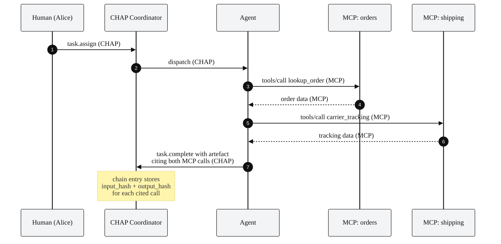

# CHAP + MCP

This document specifies how the Collaborative Human-Agent Protocol composes with the
[Model Context Protocol (MCP)](https://modelcontextprotocol.io). CHAP and
MCP address disjoint concerns:

| Concern                                | Protocol |
|----------------------------------------|----------|
| An agent calling a tool                | MCP      |
| The shared room around the agent       | CHAP      |

The composition pattern is **citation, not encapsulation**. CHAP does not
wrap MCP messages; instead, CHAP artefacts cite MCP tool invocations by
their identifiers and content hashes. The result is one signed audit
covering both protocols, while each protocol keeps its own ownership
boundary.

---

## 1. The boundary

Inside a CHAP workspace, an agent participant may call MCP tools to
gather information or perform side-effects. The MCP traffic does not
cross the CHAP wire, it goes directly from the agent to the MCP server,
authenticated and audited by MCP's own mechanisms.

What enters CHAP is the **result of the tool call as it influenced the
artefact**, plus a cryptographic reference that lets an auditor verify
exactly which call produced it.

```
┌──────────────────────────── CHAP workspace ─────────────────────────────┐
│                                                                         │
│   human ───CHAP───> coordinator ───CHAP───> agent ─┐                      │
│                                                  │ MCP                  │
│                                                  ▼                      │
│                                            ┌─────────────┐              │
│                                            │ MCP server  │              │
│                                            │ + audit log │              │
│                                            └─────────────┘              │
│                                                                         │
│   The agent's CHAP artefact carries CITATIONS of the MCP calls:          │
│      kind          = "mcp_tool_invocation"                              │
│      server, tool, call_id                                              │
│      input_hash, output_hash  (sha256 of canonical bytes)               │
│                                                                         │
└─────────────────────────────────────────────────────────────────────────┘
```

---

## 2. Citation schema

Every artefact that depended on an MCP call MUST cite that call. The
citation appears in the artefact's `citations[]` array
(see [`schemas/chap-task.schema.json`](../schemas/core/chap-task.schema.json),
`$defs.Citation`).

```json
{
  "kind": "mcp_tool_invocation",
  "server": "mcp+https://tools.example.org/orders",
  "tool": "lookup_order",
  "call_id": "call_01HZ9YX7K3X8M2V4N6P8R0T3H",
  "input_hash":  "sha256:b2c3d4e5f6071829304152637485960718293041526374859607182930415263",
  "output_hash": "sha256:d4e5f607182930415263748596071829304152637485960718293041526374a4",
  "summary": "Returned order ORD-91204: status in_transit, carrier ACME, ETA 2026-05-18."
}
```

Field semantics:

| Field         | Source                                                    |
|---------------|-----------------------------------------------------------|
| `server`      | The MCP server URL (with the `mcp+https://` scheme).      |
| `tool`        | The tool name as advertised by the server's `tools/list`. |
| `call_id`     | A locally unique identifier for this invocation. The agent generates it. |
| `input_hash`  | SHA-256 of the JCS canonicalisation of the call's `arguments`. |
| `output_hash` | SHA-256 of the JCS canonicalisation of the call's `result`. |
| `summary`     | Optional free-text precis for human readers.              |

The hashes (not the bodies) are what enter the CHAP evidence chain. An
auditor who also has access to the MCP server's call log can confirm
that the recorded hashes match the logged bodies, closing the audit
loop without requiring CHAP to store sensitive tool inputs/outputs.

---

## 3. Worked example

The agent in [`examples/02-task-delegation.md`](../examples/02-task-delegation.md)
calls two MCP tools (`order-lookup`, `carrier_tracking`) while producing
its draft response. Sequence:



---

## 4. Generating the hashes

The hashes are SHA-256 over the **JCS canonicalisation** of the call's
arguments and result. JCS is required to make the hash deterministic
regardless of field-ordering or whitespace.

Pseudocode:

```
input_hash  = sha256( JCS( tool_call.arguments ) )
output_hash = sha256( JCS( tool_call.result    ) )
```

For tools that return binary content, JCS the wrapping JSON (which
contains a base64 encoding of the binary), do not hash the raw bytes
directly. The wrapping JSON is what the MCP wire format produces and
what the MCP audit log preserves.

If a tool call **fails**, the citation MAY still be included, with
`output_hash` set to the SHA-256 of the JCS-canonicalised error
object. Recording failures is recommended; it makes "the tool tried
and failed" distinguishable from "the agent didn't try."

---

## 5. MCP authorisation gated by CHAP

A common pattern: certain MCP tool calls should require explicit
human approval before they execute. CHAP provides the approval
machinery; MCP provides the tool dispatch.

Pattern:

1. The agent identifies that a tool call requires approval. (This
   determination is made by the agent or by an MCP-server-side
   policy; CHAP does not prescribe.)
2. The agent emits `review.request` with the proposed MCP call (tool
   name, arguments, expected outcome summary) as a `draft` artefact.
3. The reviewer issues `decide.approve` or `decide.reject`.
4. On approval, the agent makes the MCP call. The agent's
   `task.complete` artefact cites both the *approved draft* (as an
   internal CHAP artefact reference) and the *resulting MCP call*
   (as an MCP citation).
5. On rejection, the agent does not make the call.

This is mechanism; the policy of "which tools need approval" lives in
your application or workspace policy, not in the protocol.

Worked example (skeleton):

```json
{
  "method": "review.request",
  "params": {
    "task_id": "tsk_…",
    "artefact_id": "art_PROPOSED_TOOL_CALL",
    "rule": "any_one_approves",
    "reviewers": ["human:approver@example.org"],
    "summary": "Proposing to issue customer credit £75 via customer-credits/issue."
  }
}
```

```json
{
  "id": "art_PROPOSED_TOOL_CALL",
  "kind": "draft",
  "content": {
    "intended_mcp_call": {
      "server": "mcp+https://tools.example.org/customer-credits",
      "tool":   "issue",
      "arguments": { "customer_id": "CUST-7K2M9", "amount_gbp": 75.0, "reason": "goodwill" }
    }
  }
}
```

After approval, the agent calls the tool and emits:

```json
{
  "method": "task.complete",
  "params": {
    "task_id": "tsk_…",
    "artefact": {
      "kind": "decision",
      "based_on": "art_PROPOSED_TOOL_CALL",
      "content": { "credit_id": "CR-5582", "amount_gbp": 75.0 },
      "citations": [
        {
          "kind": "mcp_tool_invocation",
          "server": "mcp+https://tools.example.org/customer-credits",
          "tool": "issue",
          "call_id": "call_01HZ…",
          "input_hash":  "sha256:…",
          "output_hash": "sha256:…"
        }
      ]
    }
  }
}
```

Anyone replaying the chain sees: proposed call → human approval →
executed call, all linked. The MCP server, asked separately, can
confirm the call happened with the recorded hashes.

---

## 6. Validation at acceptance time

A conformant Coordinator that wishes to validate MCP citations at
acceptance time MAY:

1. Confirm the cited `server` URI is in the workspace's
   `permitted_mcp_servers` list. If not, reject with
   `-32500` (`policy_denied`).
2. Confirm the cited tool exists on that server (via cached
   `tools/list` snapshot or live query).
3. (Optional, expensive) Query the MCP server's audit log for the
   `call_id` and verify hashes match.

Steps 1 and 2 are recommended. Step 3 is typically deferred to
audit time.

If the Coordinator cannot reach the cited MCP server at acceptance
time, it MUST still accept the artefact (the chain integrity does not
depend on liveness of external services). The verification simply
becomes "deferred to audit."

---

## 7. Privacy and the hash boundary

The CHAP evidence chain contains only **hashes** of MCP inputs and
outputs by default. This is a deliberate privacy boundary:

- Sensitive customer data the agent fetched (e.g. PII from
  `customer-history`) is *not* duplicated into CHAP.
- A verifier with access only to the CHAP chain can confirm *that* a
  particular tool was called and *that* the recorded effects are
  intact, but cannot read the call's contents.
- A verifier with the MCP server's audit log can additionally read
  the bodies and confirm the hashes match.

This split makes CHAP a good fit for environments where the workspace
audit must be highly available and broadly readable, while the tool
audit lives under stricter access controls.

If an application *does* want the bodies in the CHAP chain (because
the workspace and the MCP server share an access boundary), it MAY
inline the call's arguments and result in the citation's optional
`raw_input` / `raw_output` fields. Implementations should not do
this for sensitive content.

---

## 8. Failure handling

If an MCP call fails (network error, server error, tool error), the
agent has three options:

1. **Retry** transparently, then cite only the successful call.
2. **Cite the failure** with `output_hash` set to the hash of the
   JCS-canonicalised error, and use that information in the artefact.
3. **Abstain** with `abstain.declare` if the failure is material.

The protocol does not prescribe which option to pick; the right
answer depends on the tool's idempotency, the failure mode, and the
workspace policy.

---

## 9. Recap

| Question                                            | Answer                              |
|-----------------------------------------------------|-------------------------------------|
| Do MCP messages cross the CHAP wire?                 | No.                                 |
| Where does CHAP record the MCP call?                 | In the artefact's `citations[]`.    |
| What does CHAP commit to the chain?                  | The hashes, not the bodies.         |
| Can a CHAP-only auditor verify the chain?            | Yes (signatures + hash links).      |
| Can a CHAP-only auditor read MCP inputs/outputs?     | No (by design).                     |
| What if an MCP server requires approval per call?   | Use `review.request` → `decide.*` then call. |
| What about cross-organisation tool calls?           | Wrap them in an A2A bridge (see [CHAP-with-A2A.md](./CHAP-with-A2A.md)). |

For the wire-level details, see [`SPECIFICATION.md`](../SPECIFICATION.md)
§16.1.

---

## 10. Code

The patterns above describe the **semantic** integration: how an MCP
tool call shows up in a CHAP audit trail. CHAP 0.2.3 also ships a
**transport** integration that goes in the other direction: a CHAP
Coordinator can present itself **as** an MCP server, so any MCP
client (Claude Desktop, Cursor, Claude Code, the rest) can drive a
CHAP workspace from natural language.

### What ships

- `packages/coordinator-mcp/`. TypeScript adapter. Wrap a `Coordinator`
  with `makeChapMcpServer(coord, options)` and pass the result to any
  MCP transport.
- `chap_coordinator.transports.mcp_server`. Python adapter (installable
  via `pip install chap-coordinator[mcp]`). Same shape:
  `make_chap_mcp_server(coord, name=..., version=...)`.
- `reference/mcp-server-ts/` and `reference/mcp-server-py/`. Runnable
  stdio servers you can point an MCP client at directly.

Spec target: MCP **2025-11-25**.

### What gets exposed

All 39 CHAP methods become MCP tools, named with a `chap.` prefix to
avoid collisions with other servers a client might have loaded:

```
chap.workspace.create
chap.participant.join
chap.task.create
chap.task.update
chap.task.complete
chap.review.request
chap.decide.approve
chap.decide.reject
chap.decide.override
chap.abstain.declare
chap.escalate.raise
chap.whisper.ask
chap.whisper.answer
chap.deliberate.open
chap.deliberate.comment
chap.deliberate.vote
chap.deliberate.close
chap.handoff.propose
chap.handoff.accept
chap.handoff.decline
chap.control.pause
chap.control.resume
chap.control.cancel
chap.control.snapshot
chap.control.rollback
chap.control.supersede
chap.control.set_mode_ceiling
chap.task.route
chap.review.depth
chap.escalate.auto
chap.participant.rotate_key
chap.participant.revoke_key
chap.audit.read
chap.audit.submit_to_scitt
chap.audit.verify_receipt
chap.audit.verify_chain
chap.workspace.describe
chap.workspace.set_profiles
chap.participant.leave
```

Each tool's `inputSchema` is the JSON Schema for the corresponding
method's params. CHAP-level errors surface as MCP tool errors with
the JSON-RPC error code preserved in the response body.

### Quickstart: drive a CHAP Coordinator from Claude Desktop

See [`examples/drive-chap-from-claude-desktop.md`](../examples/drive-chap-from-claude-desktop.md).

### Composition

The two integrations stack. An MCP client can drive a CHAP workspace
via `coordinator-mcp` (this section), and the CHAP workspace can in
turn cite **other** MCP tool calls in its audit trail via the
citation pattern described in §2 above. Same MCP underneath, two
different roles for it.

### Wrap helper for inward citations

CHAP 0.2.4 also ships a small library utility that codifies the
inward citation pattern from §2:

- TypeScript: `wrapMcpToolCall(coord, workspace, options)` from
  `@chap/coordinator`. Pure data; no MCP SDK runtime cost.
- Python: `wrap_mcp_tool_call(coord, workspace, caller=..., tool=..., args=..., result=...)`
  from `chap_coordinator.transports.wrap`.

Both emit a `task.create` + `task.update` + `task.complete` triple
into the workspace's audit log, with the result artefact carrying a
`citations[]` entry holding the MCP server name, tool name, and SHA-256
hashes of the canonicalised inputs and outputs. The helper returns the
new task id and both hashes so downstream callers can cite the
wrapped event directly.

```typescript
import { Coordinator, wrapMcpToolCall } from "@chap/coordinator";

const { task_id, input_hash, output_hash } = wrapMcpToolCall(
  coord, "wsp_support_eu",
  {
    caller: "agent:drafter",
    server: "github",
    tool: "github.create_issue",
    args: { title: "bug", body: "..." },
    result: { issue_url: "https://github.com/example/repo/issues/42" },
    confidence: 0.95,
  },
);
```

```python
from chap_coordinator.transports.wrap import wrap_mcp_tool_call

res = wrap_mcp_tool_call(
    coord, "wsp_support_eu",
    caller="agent:drafter",
    server="github",
    tool="github.create_issue",
    args={"title": "bug", "body": "..."},
    result={"issue_url": "https://github.com/example/repo/issues/42"},
    confidence=0.95,
)
```

The helper exists so the citation shape stays consistent across
deployments. Hand-rolled equivalents are fine; the convenience is
single-sourcing the input/output canonicalisation and hash format.
