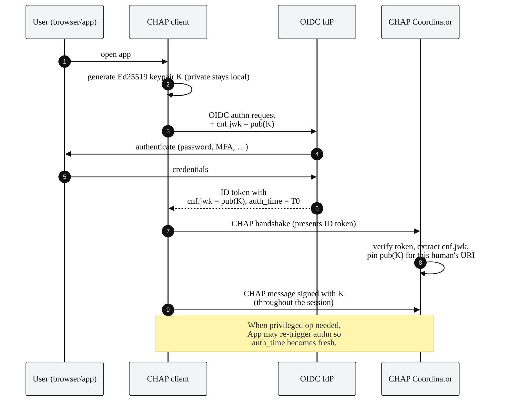
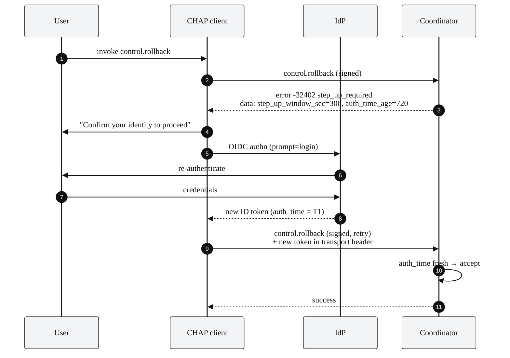

# CHAP + OIDC / OAuth 2.0

This document specifies how CHAP integrates with OpenID Connect (OIDC) and
OAuth 2.0 for identity, authentication, and authorisation.

CHAP itself is **identity-provider-agnostic**: it requires only that each
Participant have a signing key whose public half is discoverable inside
the workspace. OIDC and OAuth 2.0 are the recommended way to bind those
keys to real-world identities, particularly for humans.

The integration pattern is:

| Concern                              | Mechanism                                                   |
|--------------------------------------|-------------------------------------------------------------|
| Who is this human?                   | OIDC ID token from the org's IdP.                           |
| How is the signing key bound to that human? | `cnf.jwk` claim (RFC 7800), DPoP-style binding.       |
| How is the binding fresh enough to authorise a privileged action? | OIDC `auth_time` + CHAP step-up window. |
| How is the agent or service authenticated? | OAuth 2.0 client credentials, mTLS, or SPIFFE SVID.    |
| How does CHAP enforce scope?          | Workspace policy maps roles to permitted methods.           |

---

## 1. Human identity flow

The full sequence from "user opens the app" to "user signs a CHAP
message" runs:



The keypair is generated locally and never leaves the client. The
public half is delivered to the IdP via the `cnf.jwk` request
parameter (or its equivalent in the IdP's supported flow). The IdP
echoes it back inside the ID token as a confirmation claim, signing
the entire token. The Coordinator trusts the IdP's signature, reads
the `cnf.jwk`, and pins it as the human Participant's signing key for
the session.

---

## 2. Token shape

A typical ID token payload from a CHAP-aware IdP:

```json
{
  "iss": "https://idp.example.org",
  "sub": "user-7f3c2a8e",
  "aud": "chap-coordinator-prod",
  "iat": 1747476000,
  "exp": 1747479600,
  "auth_time": 1747476000,
  "acr": "urn:example:authn:mfa",
  "amr": ["pwd", "totp"],

  "email": "[email protected]",
  "preferred_username": "alice",
  "chap_participant_uri": "human:alice@example.org",

  "cnf": {
    "jwk": {
      "kty": "OKP",
      "crv": "Ed25519",
      "kid": "k-2026-05-17a",
      "x":   "11qYAYKxCrfVS_7TyWQHOg7hcvPapiMlrwIaaPcHURo"
    }
  }
}
```

Required claims for CHAP binding:

| Claim                  | Purpose                                                    |
|------------------------|------------------------------------------------------------|
| `iss`, `aud`, `exp`    | Standard OIDC.                                             |
| `sub`                  | The user's stable identifier at the IdP.                   |
| `auth_time`            | When the user last authenticated; used for step-up.        |
| `acr` (RECOMMENDED)    | Authentication context class (e.g. MFA tier).              |
| `chap_participant_uri`  | The CHAP Participant URI this token authorises.             |
| `cnf.jwk`              | The CHAP signing key bound to this session.                 |

If `chap_participant_uri` is absent, the Coordinator maps `sub` to a
CHAP URI via deployment configuration.

---

## 3. Signing a CHAP message

After binding, the client's send-message path is:

```typescript
function sendHapMessage(envelope: HapEnvelope, key: Ed25519PrivateKey): SignedEnvelope {
  // 1. Compute prev_hash from local chain state (or ask Coordinator).
  envelope.evidence = { prev_hash: currentHead(), sig: "" };

  // 2. Canonicalise without the sig field.
  const canonical = jcsCanonicalise({ ...envelope, evidence: { prev_hash: envelope.evidence.prev_hash } });

  // 3. Sign.
  const sig = ed25519Sign(key, canonical);

  // 4. Inject signature.
  envelope.evidence.sig = `ed25519:${kid(key)}:${b64(sig)}`;
  return envelope;
}
```

The Coordinator's verify path:

```typescript
function verify(envelope: SignedEnvelope): boolean {
  const claimedFrom = envelope.from;
  const claimedTs   = envelope.ts;

  // 1. Look up the pinned public key for `from` as of `ts`.
  const pubKey = lookupPubKey(claimedFrom, claimedTs);
  if (!pubKey) return false;

  // 2. Canonicalise without sig.
  const withoutSig = { ...envelope, evidence: { prev_hash: envelope.evidence.prev_hash } };
  const canonical  = jcsCanonicalise(withoutSig);

  // 3. Verify signature.
  return ed25519Verify(pubKey, canonical, envelope.evidence.sig);
}
```

---

## 4. Step-up authentication

Methods marked `privileged: true` in the catalogue require a fresh
`auth_time`. The default window is 5 minutes; the workspace's
descriptor publishes the configured value (`step_up_window_sec`).

Server-side check:

```typescript
function checkStepUp(method: string, idToken: IdToken, policy: WorkspacePolicy): boolean {
  if (!methodIsPrivileged(method)) return true;

  const now = Date.now() / 1000;
  const authTimeAge = now - idToken.auth_time;
  return authTimeAge <= policy.step_up_window_sec;
}
```

Client-side, when the user tries a privileged operation and the
window has lapsed, the client triggers a re-authentication
(`prompt=login`) with the IdP, receives a new ID token with a fresh
`auth_time` (and possibly a new ephemeral key via a refreshed
`cnf.jwk`), and retries the operation.

A typical privileged-op flow:



The step-up flow is entirely standard OIDC; CHAP's contribution is the
error code and the policy hook that triggers it.

---

## 5. Agent and service authentication

Agents and services do not have a human at a keyboard, so the OIDC
human flow doesn't apply. Recommended options, in order of
preference:

### 5.1 SPIFFE

In a service-mesh deployment with SPIFFE, each workload has an SVID
(SPIFFE Verifiable Identity Document), typically an X.509 cert with
the workload's SPIFFE ID as a SAN. The CHAP signing key is bound to
the SPIFFE ID via the workload identity infrastructure; the agent's
descriptor lists its current key and rotates as SPIFFE rotates.

### 5.2 mTLS with private CA

For deployments without SPIFFE, an internal CA issues client
certificates. The CHAP signing key is bound to the certificate's
subject. Rotation is typically driven by cert expiry.

### 5.3 OAuth 2.0 client credentials

A fallback: the agent obtains a token from the IdP via the
`client_credentials` grant. The token's `cnf.jwk` (if supported by
the IdP) binds the CHAP signing key, exactly as for humans. The
client id maps to the agent's CHAP URI.

---

## 6. Scope and authorisation

OIDC/OAuth 2.0 scopes are about *what the bearer can ask the IdP for*;
CHAP method-role authorisation is about *what the workspace lets a
member do*. These are different layers, and they must compose.

Typical mapping:

```
OIDC scope            ──maps to──>   CHAP role(s) in this workspace
─────────────────────────────────────────────────────────────────────
chap.user                              reviewer
chap.user                              drafter (for the user's own tasks)
chap.admin                             admin
chap.audit                             auditor (read-only, audit.read)
chap.coordinator                       coordinator (service role)
```

The mapping is deployment-specific and lives in the workspace's
policy. The OIDC token grants the human the ability to *act as*
`human:alice@example.org` in CHAP; the workspace policy decides what
that participant is allowed to do.

Two-level enforcement:

1. **Transport-time:** the Coordinator verifies the OIDC token's
   signature, expiry, audience, and scope against its minimum
   accept-policy.
2. **Method-time:** for every incoming CHAP message, the Coordinator
   verifies the participant's role and consults the method-role
   matrix in the workspace policy.

Both checks must pass.

---

## 7. Key rotation

Three rotation triggers:

1. **OIDC token refresh.** A new ID token may carry the same
   `cnf.jwk` (key reused) or a new one (key rotated). The client
   tells the Coordinator about the new key via `participant.rotate_key`.
2. **Periodic rotation.** Long-lived service identities rotate
   keys on a schedule (typically daily). Each rotation is a
   `participant.rotate_key` signed with the old key.
3. **Suspected compromise.** An admin issues
   `participant.revoke_key` for the affected key.

The Coordinator's verify path consults a key-history table when
verifying a message: signatures must match a key that was valid for
that participant *at the message's timestamp*. A revoked key remains
valid for verifying messages dated before its revocation.

---

## 8. Logout and session end

When a human logs out, the client SHOULD:

1. Discard the local private key (zero the memory).
2. Notify the Coordinator with `participant.announce` whose params
   set the participant's status to `offline`.
3. Optionally trigger `participant.revoke_key` if the local key
   storage was suspected of compromise.

The Coordinator records the offline announce in the chain. Subsequent
messages purporting to come from this human and signed by the
now-discarded key will fail verification because the Coordinator's
key cache no longer accepts the key (it can also reject based on the
recorded offline notice, depending on implementation).

---

## 9. PII and audit

OIDC tokens may contain PII (email, name). CHAP's evidence chain
**does not** store the ID token itself, it stores the participant
URI (the abstract identifier), the public key, and the signature.
A separate access-controlled log can correlate URI to identity for
operational purposes, but the audit chain in isolation reveals only
the URI.

This separation makes the chain usable in environments with strict
data-minimisation requirements.

---

## 10. Recap

| Question                                                        | Answer                                       |
|-----------------------------------------------------------------|----------------------------------------------|
| How does CHAP know who a human is?                               | OIDC ID token + `cnf.jwk` binding.           |
| Where does the signing key live?                                | On the client (ephemeral, per session).      |
| How do privileged ops require fresh auth?                       | OIDC `auth_time` + step-up window.           |
| How are agents and services authenticated?                      | SPIFFE, mTLS, or OAuth 2.0 client credentials. |
| How are scope and role composed?                                | OIDC scope → workspace role → method-role matrix. |
| What's in the chain. PII or URIs?                              | URIs and keys; PII is correlated separately. |
| How is rotation handled?                                        | `participant.rotate_key`, signed by old key. |
| What if the key is compromised?                                 | `participant.revoke_key`, signed by an admin.|
