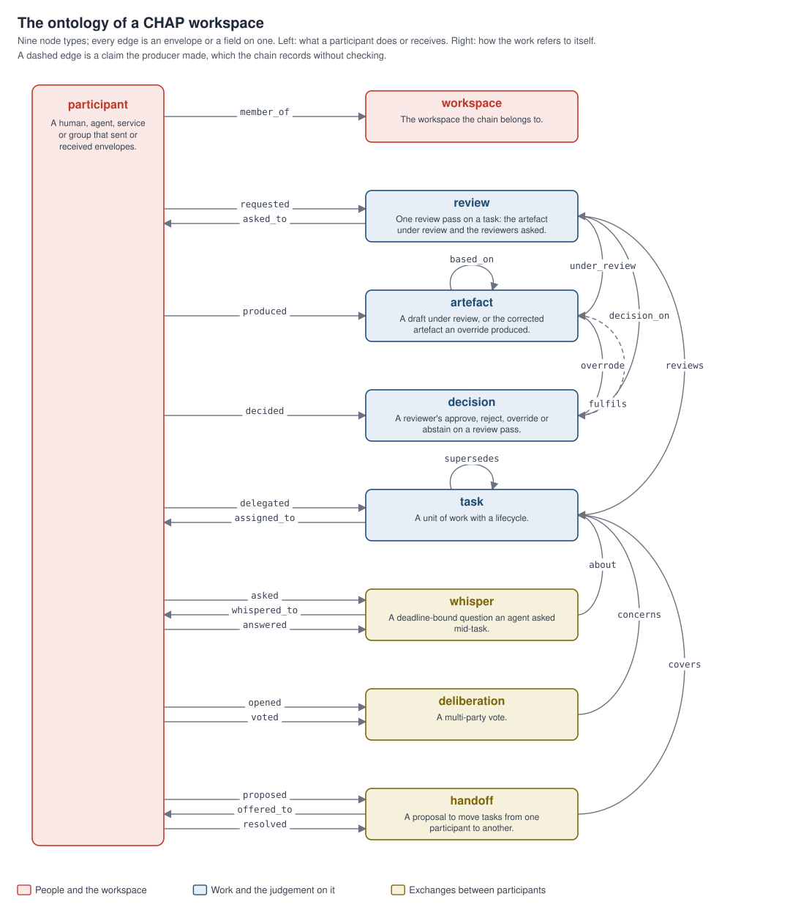
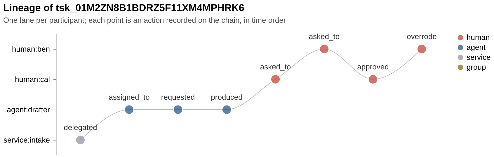
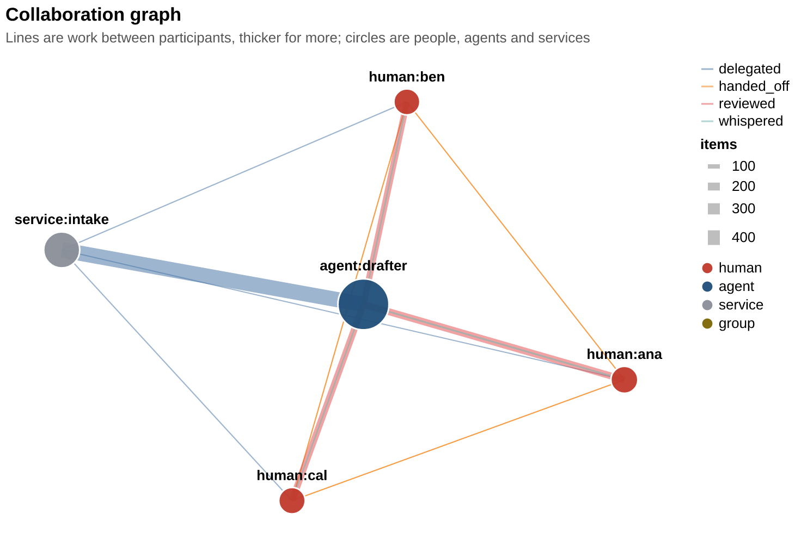

# The chain as a graph

`chap_analytics.graph` reads the same chain the tables come from as a typed
graph. It is a second projection of the same envelopes, built from a
`Frames` object, so every node and edge traces back to an envelope or a
field on one, and task nodes carry the same `id_certain` mark the `tasks`
table does.

<p align="center">

</p>

## The ontology

Nine node types. `graph.NODE_TYPES` holds the same list with a line on each.

| Node | Stands for |
|---|---|
| `workspace` | The workspace the chain belongs to. |
| `participant` | A human, agent, service or group that sent or received envelopes. `kind` carries which. |
| `task` | A unit of work with a lifecycle. |
| `review` | One review pass on a task: the artefact under review and the reviewers asked. |
| `artefact` | A draft under review, or the corrected artefact an override produced. |
| `decision` | A reviewer's approve, reject, override or abstain on a review pass. |
| `whisper` | A deadline-bound question an agent asked mid-task. |
| `deliberation` | A multi-party vote. |
| `handoff` | A proposal to move tasks from one participant to another. |

Twenty-five edge types, each from one node type to one node type, each
recorded by a named envelope or field. `graph.EDGE_TYPES` holds the same
table, and `to_node_link` writes it into the export under `ontology`.

| Edge | From | To | Recorded by |
|---|---|---|---|
| `member_of` | participant | workspace | `participant.join` |
| `delegated` | participant | task | `task.create`, by the delegator |
| `assigned_to` | task | participant | the current assignee, after any handoff or routing |
| `produced` | participant | artefact | `task.complete` or `review.request` carrying the artefact |
| `under_review` | review | artefact | the artefact a review pass judged |
| `requested` | participant | review | `review.request`, or the `task.complete` that opened the review |
| `asked_to` | review | participant | `review.request` `to`; where a review was opened implicitly, the reviewers who decided it |
| `reviews` | review | task | the task the pass belongs to |
| `decided` | participant | decision | `decide.approve`, `decide.reject`, `decide.override` or `abstain.declare` |
| `decision_on` | decision | review | the pass the decision settled or contributed to |
| `based_on` | artefact | artefact | an override's corrected artefact and the draft it was derived from |
| `overrode` | decision | artefact | the corrected artefact an override decision produced |
| `fulfils` | artefact | decision | the `fulfils` field of the artefact a `task.complete` carried: the decision an execution says it carries out; the producer's claim, recorded without verification |
| `supersedes` | task | task | `escalate.raise` or `control.supersede`: the successor and the task it replaced |
| `asked` | participant | whisper | `whisper.ask` |
| `whispered_to` | whisper | participant | `whisper.ask` `to` |
| `answered` | participant | whisper | `whisper.answer` |
| `about` | whisper | task | the task a whisper concerns |
| `proposed` | participant | handoff | `handoff.propose` |
| `offered_to` | handoff | participant | the recipient named on the proposal |
| `resolved` | participant | handoff | `handoff.accept` or `handoff.decline`; `resolution` carries which |
| `covers` | handoff | task | a task the handoff proposed to move |
| `opened` | participant | deliberation | `deliberate.open` |
| `concerns` | deliberation | task | `deliberate.open` naming the task the vote is about |
| `voted` | participant | deliberation | `deliberate.vote`; `vote` carries yea, nay or abstain |

Edges carry `seq` and `ts` from the envelope that recorded them where one
did, and an attribute where the envelope carried something worth keeping:
a vote's `vote`, a handoff resolution's `resolution`, and `certain` on an
assignment inferred from envelopes alone. Nodes carry the rest: a
decision's `kind`, `is_final`, `latency_s` and `tags`; a corrected
artefact's `intent_preserved` and `top_path`; a task's `kind`, `state`,
`mode`, `outcome` and `id_certain`; a participant's `kind` and `role`. A
test checks that every edge in a built graph joins the node types its
declaration names.

`graph.ontology_svg()` draws the diagram above from these two tables. The
participant is a lane down the left, because it touches every other type;
what a participant does or receives runs as straight spokes to the column
of node types beside it, with the arrow pointing the way the edge runs.
What the work says about itself runs as arcs down the right, nested by
span, with the task in the middle of the column so that the review chain
above it and the exchanges below it reach it over the shortest spans. The
two self-references, `based_on` on the artefact and `supersedes` on the
task, are loops above their boxes. One edge is drawn dashed: `fulfils`
records a claim the producer made, the decision its artefact carries out,
which the chain holds without checking. SPECIFICATION 9.4 puts the field
on the artefact, so it is read from the output a `task.complete` carried,
and it appears whenever a chain carries one. Every edge type appears whenever the chain holds the envelope
that records it.

## Building it

```python
from chap_analytics import frames, graph
from chap_analytics.sample import support_desk

f = frames(support_desk())
g = graph.build(f)

len(g.nodes), len(g.edges)
g.nodes["human:maya"].type                          # "participant"
around = g.neighbours("human:maya")                 # every node one edge away
g.subgraph(around | {"human:maya"})                 # the induced subgraph on a set of ids
```

Review passes that were never decided are in the graph as review nodes
with `requested`, `under_review` and `asked_to` edges and no `decision_on`
edge, which is how the open queue looks from the graph side.

## Two views

### The lineage of one task

```python
task_id = f.tasks["task_id"].iloc[-1]
sub = graph.lineage(f, task_id)          # a Graph
rows = graph.lineage_table(f, task_id)   # who did what to which node, in time order
lanes = graph.layout_lanes(rows)         # x in time order, one lane per participant
```

Everything that led to one task: the task, the tasks it superseded and was
superseded by, their review passes, artefacts, decisions, whispers,
handoffs and deliberations, and the participants at each step. Participants
are included as endpoints and are not traversed through, so a reviewer's
other work stays out of the picture. `lineage_table` flattens it into rows
an auditor can read top to bottom, and `layout_lanes` gives the swimlane
the chart draws, with humans above agents and services.

<p align="center">

</p>

### The collaboration graph

```python
edges = graph.collaboration(f)                  # one row per (source, target, relation)
pos = graph.layout_spring(edges)                # Fruchterman-Reingold positions, deterministic for a seed
cent = graph.centrality(f)                      # degree, weighted degree, betweenness
```

The participants of a workspace and the work that passed between them, as
weighted directed edges. `reviewed` runs from a reviewer to the assignee
whose work they decided on, with the number of decisions and the mean
latency. `delegated` runs from delegator to assignee. `handed_off` from
proposer to recipient with the resolution counts. `whispered` from asker to
answerer. The chart sizes each participant by the work that passed
through them, in and out, and colours them by kind.

<p align="center">

</p>

## The graph statistics

Four rows of the decision table are answered from the graph.

**Find the bottleneck.** `centrality(f)` gives in and out degree, weighted
in and out, and betweenness per participant. `concentration(f)` gives, for
each assignee, the top reviewer's share of its decisions and the Herfindahl
index over its reviewers, so "one person decides everything this agent
does" is a number with a threshold.

**Confirm there is a person in the loop.** `coverage(f)` walks each task
whose work went out and asks whether a human decided on it or on a task it
superseded, or whether a human did the work. The result carries the share
and lists the uncovered task ids, which is the list to act on.

**Separate duties.** `duties(f)` lists the places one actor held two roles
that should be separate: a task's assignee deciding its own review, the
person who delegated a task deciding it, the proposer of a handoff
resolving it, and a decision on a review made by an agent or a service.

**Trace one outcome to its origin.** `lineage` and `lineage_table`, above.

## Exports

```python
graph.to_node_link(g)      # {"workspace", "ontology", "nodes": [...], "edges": [...]}
graph.dumps(g, indent=2)   # the same as JSON text
graph.to_graphml(g)        # GraphML text, with type and label keys
graph.to_networkx(g)       # a networkx.MultiDiGraph, with the graph extra installed
```

The node-link export includes the ontology, so a graph database or a
knowledge-graph tool can load it with the types declared alongside the
data. GraphML is the interchange format most desktop graph tools read. The
networkx graph keeps every node and edge attribute and is the route to any
algorithm the package does not carry.

## What the graph does and does not assert

An edge says an envelope was recorded, and no more. `fulfils` in particular
is a claim the producer made about which decision its artefact carries
out; the id is kept as the producer wrote it, and the edge lands on a
decision node marked `referenced`, since node ids here are built from the
task and the sequence number rather than from the protocol's artefact ids.
`assigned_to` is the assignee
after any routing or handoff, which is certain from a snapshot and inferred
from envelopes alone where `assignee_certain` on the `tasks` table says so.
A task whose id had to be inferred from the order of events carries
`id_certain=False` on its node, and the lineage of such a task should be
read with that in mind.
