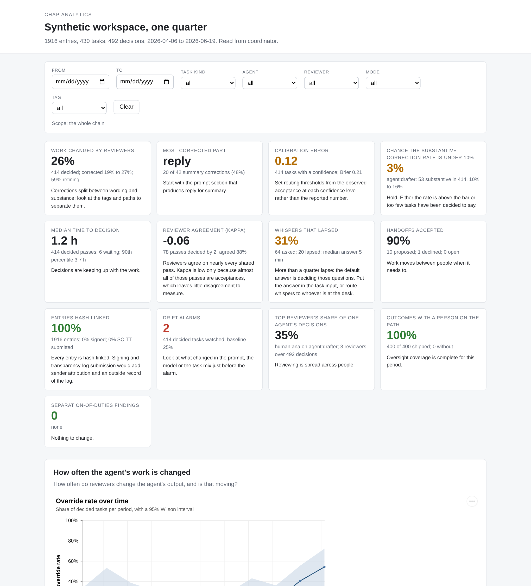

# The report

`chap_analytics.report` assembles every decision in the table into one HTML
file. It opens from disk or a file share with no network, and the cards
and charts recompute in the browser as the reader filters.

```python
from chap_analytics import from_sqlite, frames, report

f = frames(from_sqlite("./chap.db", workspace="wsp_support"))
report.write(f, "support.html", title="Support desk, Q2")
```

`write` takes the same keyword arguments as `build`: `title`, `threshold`
(the promotion bar, default 10%), `freq` (the period for the rate over
time, default weekly) and `rationales` (whether reviewers' rationales are
embedded, default true).

<p align="center">

</p>

## What is on the page

**The header** names the workspace, the counts of entries, tasks and
decisions, the period the chain covers, and where it was read from.

**The filter bar** carries a date range, task kind, agent, reviewer, mode
and tag. Every chart, every headline card and the open queue answer to it.
A line under the bar states the scope in words. The date range filters on
when a task settled, or was created where it has not settled; the reviewer
filter keeps the tasks that reviewer settled; the tag filter keeps the
tasks whose settling decision carried that tag.

**The headline cards**, one per decision in the table that has a number
(the lineage has its own view at the end): the figure, its interval and
sample size, and, on the unfiltered page, the decision line
from the brief for that section, so the card and the section below it
agree. A number is coloured by what it says: green where the finding is
reassuring, amber where it asks for attention, red where it asks for
action. A card drawn faint rests on too few rows to read. Clicking a card
scrolls to its section.

**The sections**, one per decision, each with its question, its charts,
and the brief in full: the headline, a paragraph of context, and the
decision the numbers support. In order: how often the agent's work is
changed; where the corrections land; whether confidence can be trusted;
whether an agent is ready to promote; how long decisions take; whether
reviewers agree; whether agents get answers; whether handoffs are
accepted; whether the record holds up; whether the correction rate has
moved; and who carries the reviewing, with the coverage and
separation-of-duties findings beside the collaboration graph.

**Three things to click.** A cell of the correction heatmap lists the
overrides behind it: who corrected what, when, and the rationale they
gave. The open queue under the latency section lists the oldest 25 reviews
still waiting. The lineage selector at the end opens the history of any
task as a swimlane; the lineage and the layout of the collaboration graph
are drawn from the whole chain and do not change with the filter.

**Brushing** the time axis of the rate-over-time chart sets the date
range, so a reader who sees a rise can scope the whole page to it in one
gesture.

## How it is built

The file has five parts inlined into one template: the Vega, Vega-Lite and
vega-embed runtimes the package ships in `chap_analytics/_vendor`; a
JavaScript mirror of the library's statistics, `stats.js`; the page logic,
`report.js`; the stylesheet; and a JSON payload.

The payload holds the row-level tables the statistics need, with artefact
content left out: tasks, decisions, overrides, patch operations, review
passes, whispers, handoffs, the events reduced to what the assurance chart
reads, the collaboration edges with their layout and centrality, and the
lineage rows of every task. It also holds the chart specifications as
`charts.everything` produced them, the briefs as `briefs.everything`
produced them, and a lookup table of CUSUM decision intervals simulated in
Python at 0.02 steps of baseline rate, so the browser can re-tune the drift
chart for a filtered baseline by taking the nearest entry.

On a filter change the page selects the rows in scope, recomputes each
statistic with `stats.js`, replaces the data in the chart's specification,
and embeds the chart again. The headline cards are recomputed from the
same numbers. `stats.js` mirrors the functions the page recomputes: Wilson
intervals, the incomplete beta function for the promotion posterior, the
period bucketing, the Kaplan-Meier estimator with Greenwood bounds, Fleiss'
and Cohen's kappa on review passes, the sequential test, the CUSUM, and the
graph statistics for coverage, concentration and duties. A test in the
suite runs `stats.js` under Node on the tables the report embeds and
compares every number with the Python functions, so a filtered view in the
browser gives the answer a notebook would. The briefs in each section are
the Python text for the whole chain and stay as written under a filter; the
cards and charts are what move.

`report.embedded_data(f)` returns the payload's tables, which is also what
that test feeds to the browser statistics.

## What stays out

Artefact content never enters the file: task inputs and outputs, the
artefact under review, the corrected artefact, and the values a patch
writes are left out of the embedded rows whatever the loader's redaction
setting. Patch paths and operation types are kept, since they are the
analysis. Rationales, tags and policy references are kept by default;
`rationales=False` leaves the rationales out for a report that will travel
further than the reviewers' words should. The question a whisper or a
deliberation asked is kept as the label of its node in the lineage view,
as the README says of the tables; a deployment that needs it removed strips
the field before loading.

## Size

A report for the sample week is around a megabyte, most of it the
runtime. The payload grows with the chain at a few kilobytes per task, the
larger part of that being each task's lineage rows, so a quarter of a busy
workspace with a few hundred tasks is a file of two or three megabytes
that opens from disk. A report opened from a file share fetches nothing.

## Regenerating it

The report is built from a `Frames` object and is regenerated rather than
edited. `chap_analytics.watch.Watcher` regenerates it on a schedule from a
live workspace:

```python
from chap_analytics import watch

w = watch.Watcher("http://localhost:8080/chap", "wsp_support", report_path="support.html")
w.run(interval_s=300)
```

Each poll reads what is new from `audit.read`, re-projects, checks the
drift chart, and rewrites the file.
